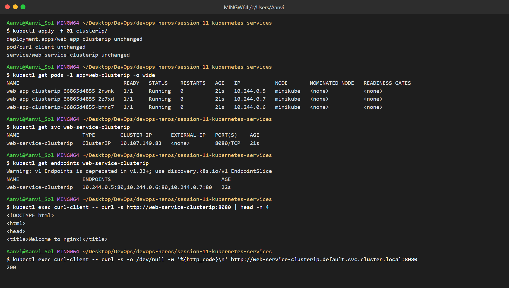
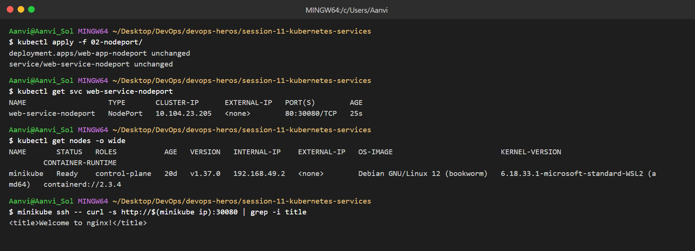
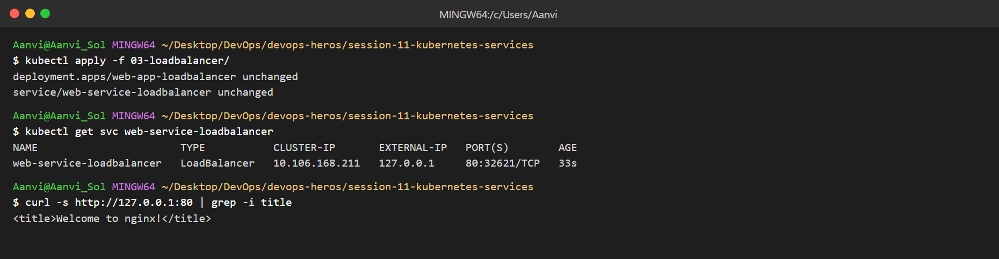
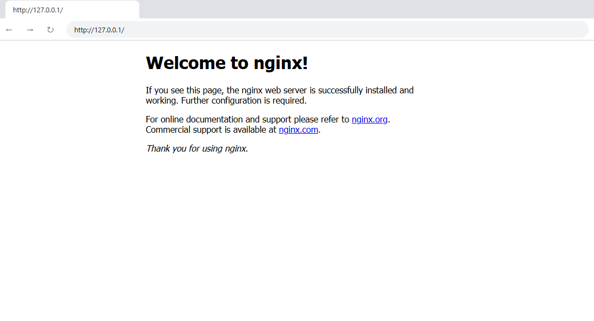
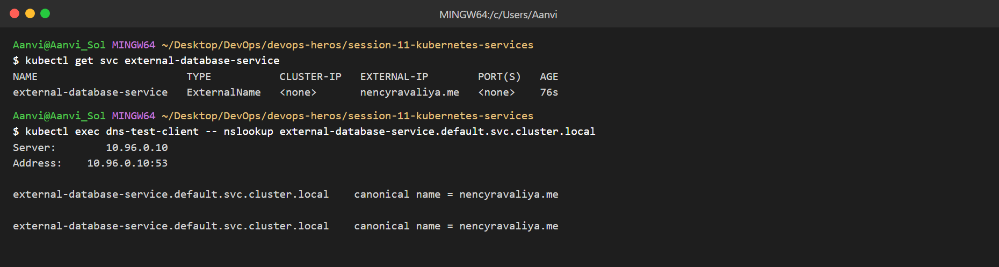
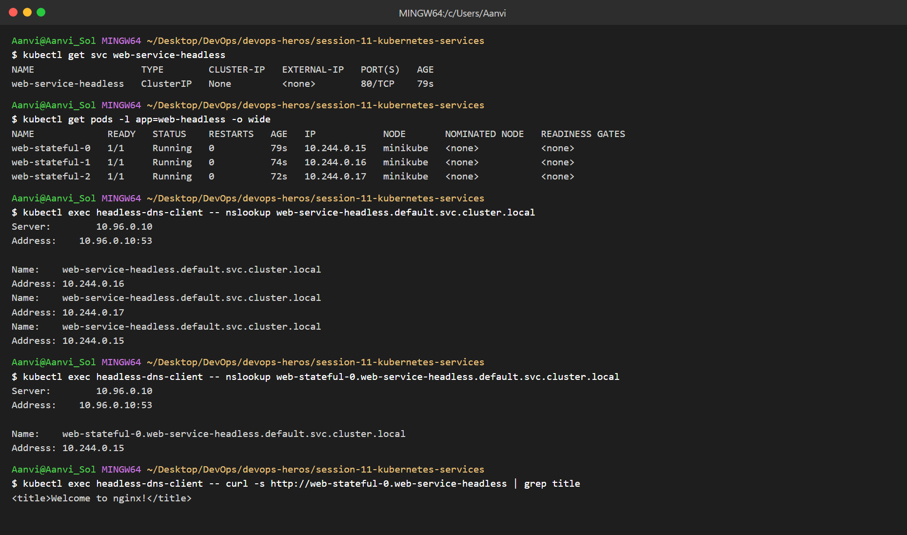
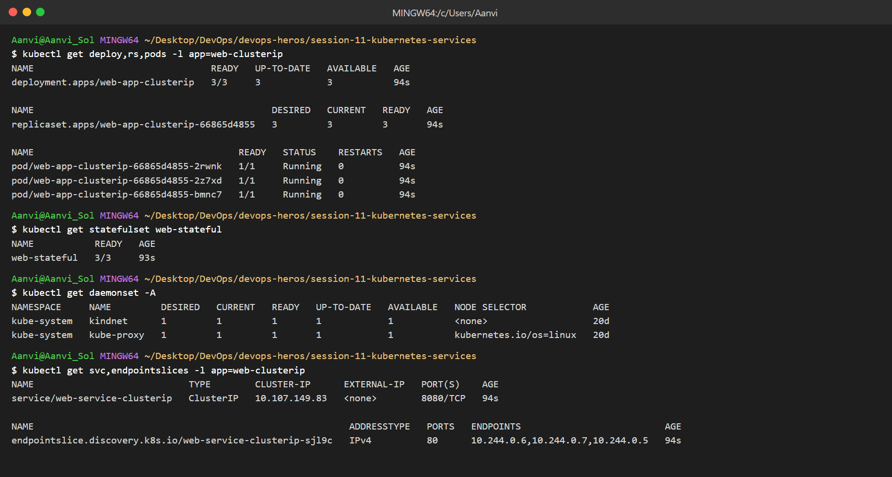
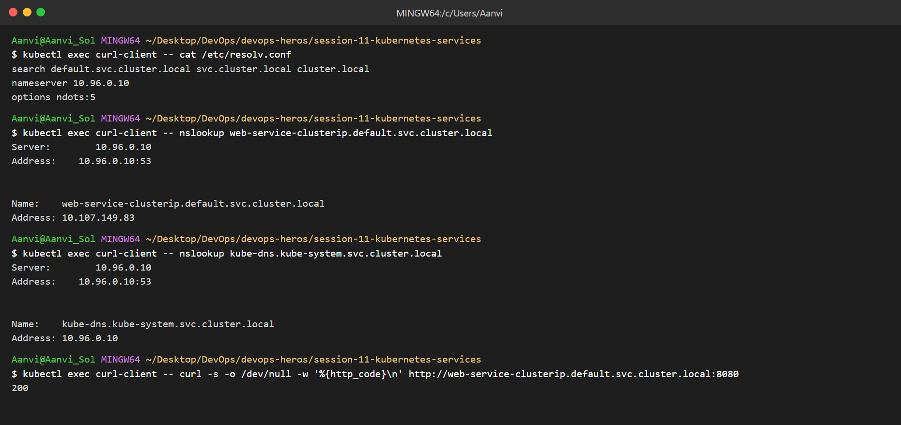
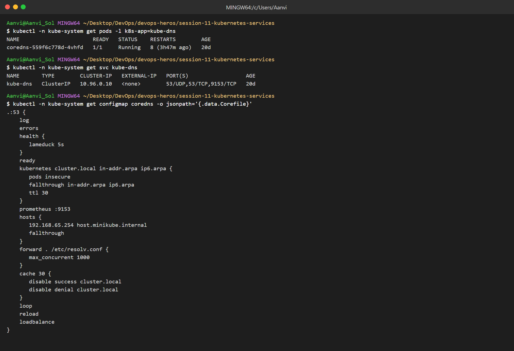

# Kubernetes Services

Name: Aanvi Solanki     Roll no.: 24bcs10170        Group: A

## Task 1: Service Types

### 1. ClusterIP

### 2. NodePort

### 3. LoadBalancer

### 4. ExternalName

### 5. Headless

## Task 2: Object Comparison

### Deployment vs ReplicaSet

| | Deployment | ReplicaSet |
|---|---|---|
| Purpose | Manages app versions and updates | Keeps N identical Pods running |
| Pod management | Through ReplicaSets | Directly creates/deletes Pods |
| Scaling | `kubectl scale deploy` | `kubectl scale rs` |
| Rolling updates | Yes, with rollback | No |
| Relationship | Creates one ReplicaSet per version | Owned by a Deployment |

### Deployment vs DaemonSet vs StatefulSet

| | Deployment | DaemonSet | StatefulSet |
|---|---|---|---|
| Use case | Stateless apps | One Pod per node | Stateful apps |
| Pod creation | Random names, parallel | One per node | Ordered, `name-0`, `name-1` |
| Scaling | replicas | Follows node count | replicas, in order |
| Networking | Shared Service | Usually host-level | Stable DNS via headless Service |
| Storage | Shared/none | hostPath | Own PVC per Pod |
| Examples | Web apps, APIs | kube-proxy, log agents | MySQL, MongoDB |

### ReplicaSet vs Service

* ReplicaSet keeps the right number of Pods running.
* Service gives those Pods one stable IP and DNS name.
* Pod IPs change on restart, so a Service is needed to reach them.
* Traffic: client → Service IP → kube-proxy → matching Pod endpoints (by label selector).

## Task 3: FQDN

* FQDN = complete domain name of a host.
* Service DNS format: `<service>.<namespace>.svc.cluster.local`
* Pod in StatefulSet: `<pod>.<headless-service>.<namespace>.svc.cluster.local`
* Same namespace: just `<service>` works (search domains in `/etc/resolv.conf`).
* Other namespace: `<service>.<namespace>`.
* Examples:
  * `web-service-clusterip.default.svc.cluster.local`
  * `kube-dns.kube-system.svc.cluster.local`
  * `web-stateful-0.web-service-headless.default.svc.cluster.local`

## Task 4: CoreDNS

* CoreDNS is the DNS server of the cluster (runs in `kube-system`, Service `kube-dns`).
* Used for Service discovery by name instead of IP.
* Pods use `nameserver 10.96.0.10` from `/etc/resolv.conf`.
* `kubernetes` plugin answers `cluster.local` names; other names are forwarded to upstream DNS.
* Config is the `Corefile` in the `coredns` ConfigMap.
* Troubleshooting:
  * `kubectl get pods -n kube-system -l k8s-app=kube-dns`
  * `kubectl logs -n kube-system -l k8s-app=kube-dns`
  * `kubectl exec <pod> -- nslookup <service>`
  * `kubectl get endpoints <service>`
