# Ingress, Configmaps, Secrets

Name: Aanvi Solanki     Roll no.: 24bcs10170        Group: A

## Port achitecture

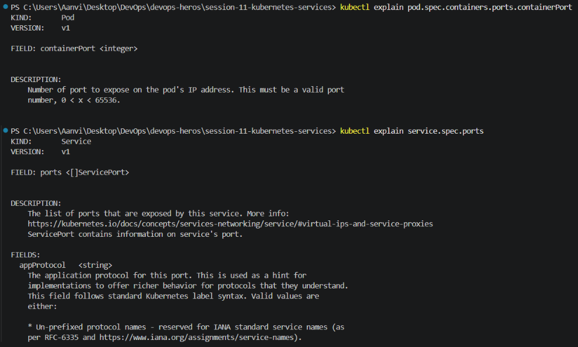

## ClusterIP

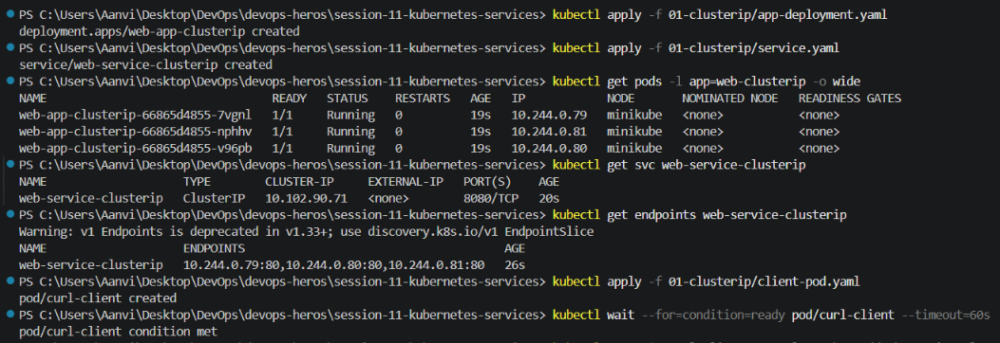

## Nodeport

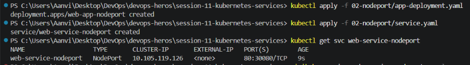

## Configmaps, secrets, replicaset

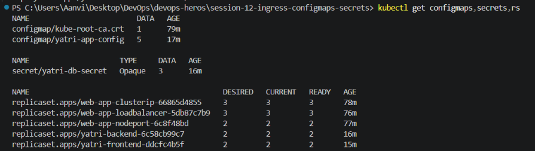

## Task 1: ConfigMap

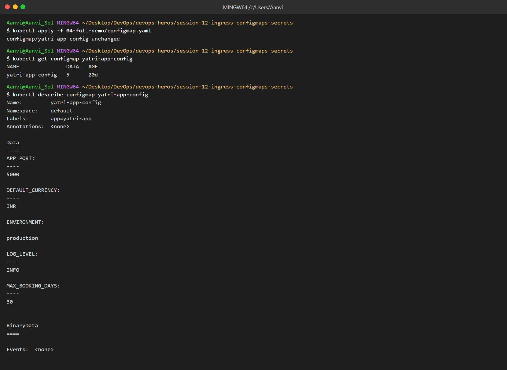
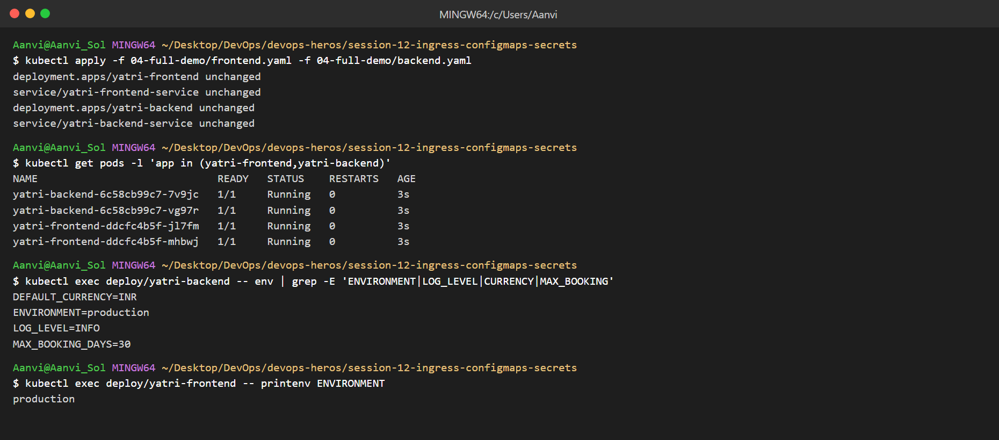

## Task 2: Secret

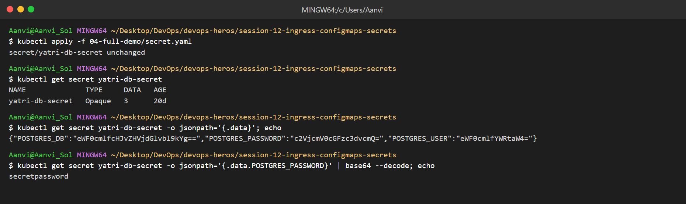
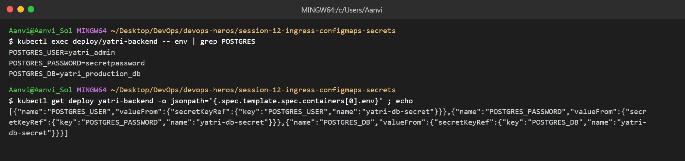

* Secrets are only base64 encoded, not encrypted - anyone with the repo can decode them, so they should not be committed to Git.

## Task 3: Ingress

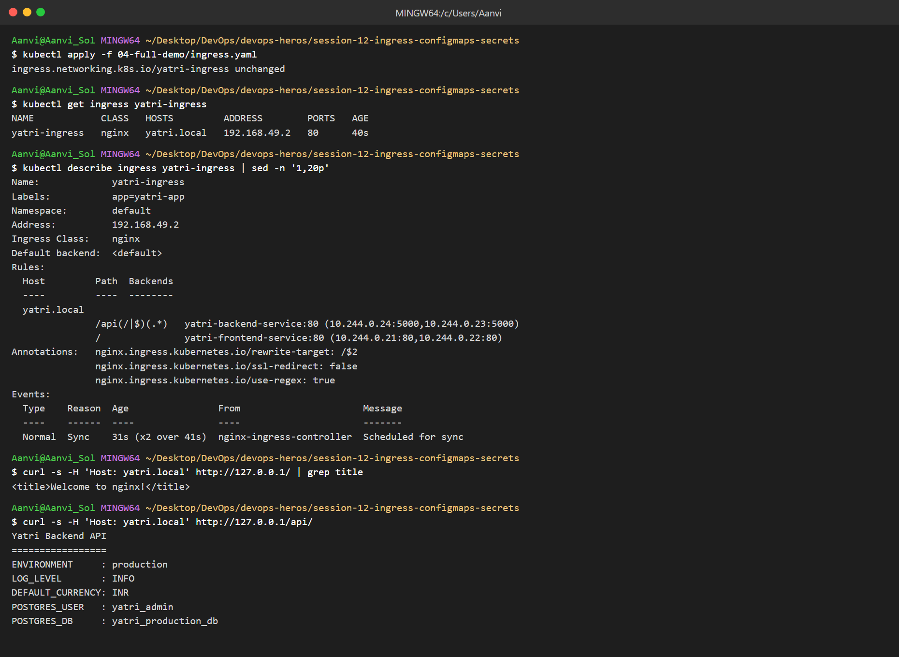
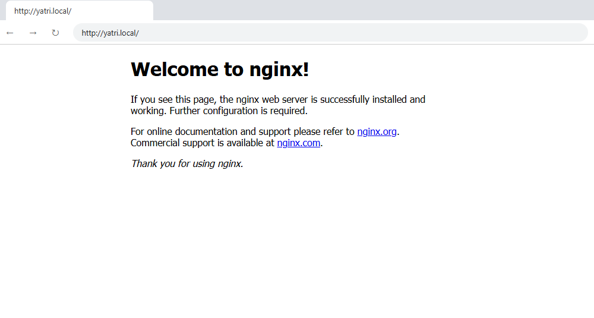
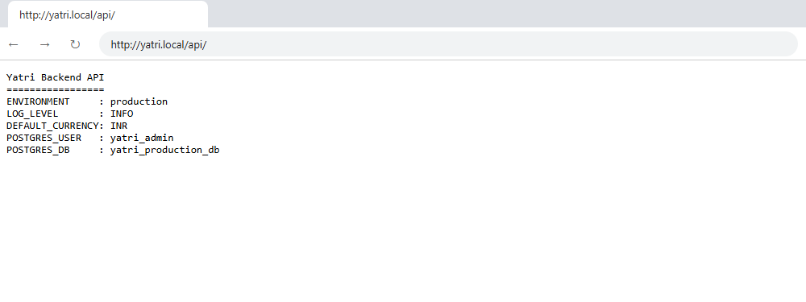

## Task 4: Ingress vs Ingress Controller

| | Ingress | Ingress Controller |
|---|---|---|
| What | YAML rules (host/path → Service) | Pod that reads the rules and routes traffic |
| Type | Kubernetes resource | Application (nginx, Traefik, HAProxy) |
| Works alone? | No, just config | Needs Ingress rules to act on |
| Example | `yatri-ingress` | `ingress-nginx-controller` |

* Both are required: Ingress defines the routing, the Controller actually does it.

## Task 5: Troubleshooting (Secret base64 newline)

### Before
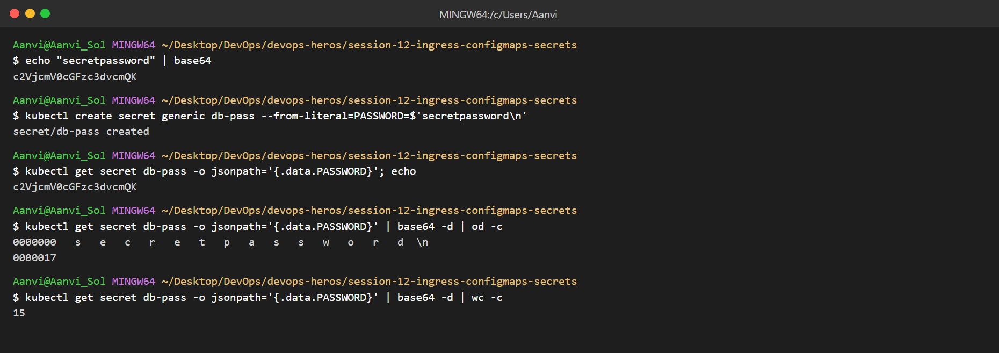

### After
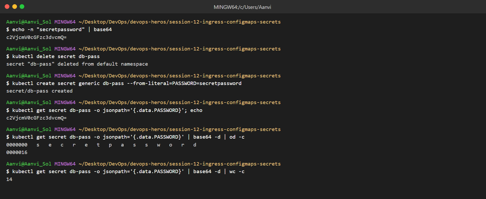

* Root cause: `echo` adds `\n`, so the password becomes 15 bytes instead of 14.
* Fix: use `echo -n` (or `--from-literal`).
