# Storage, HPA & Probes

Name: Aanvi Solanki     Roll no.: 24bcs10170        Group: A

## Task 1: Kubernetes Volumes

| Type | What it is | Data after pod delete |
|---|---|---|
| emptyDir | Temporary folder created with the pod | Lost |
| hostPath | Folder on the node mounted into the pod | Kept (same node only) |
| PersistentVolume (PV) | Storage resource in the cluster, created by admin | Kept |
| PersistentVolumeClaim (PVC) | Pod's request for storage, binds to a PV | Kept |
| StorageClass | Template that creates PVs automatically | Kept |

* Dynamic provisioning: PVC asks a StorageClass, and the PV is created automatically (no admin needed).

### emptyDir

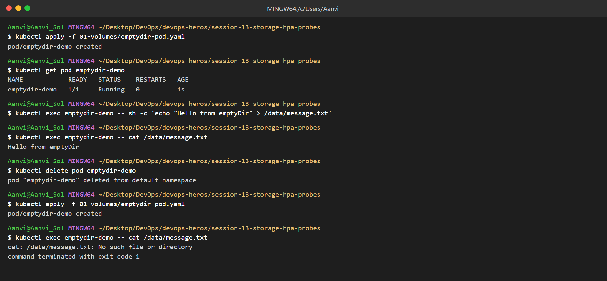

### hostPath

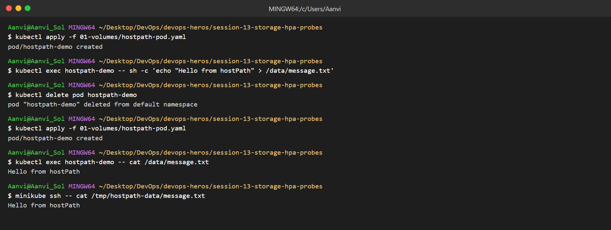

### PersistentVolume & PersistentVolumeClaim

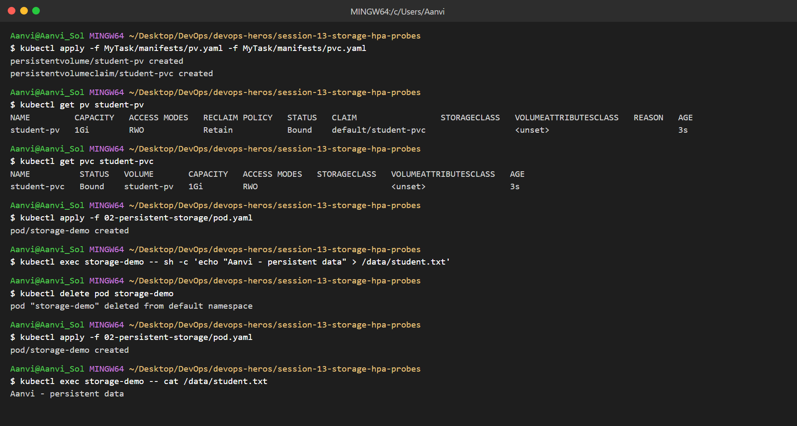

### StorageClass & Dynamic Provisioning

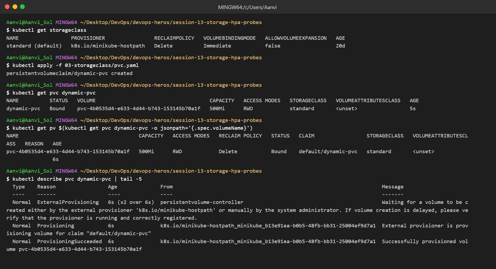

## Task 2: HPA

### Deploy app and HPA

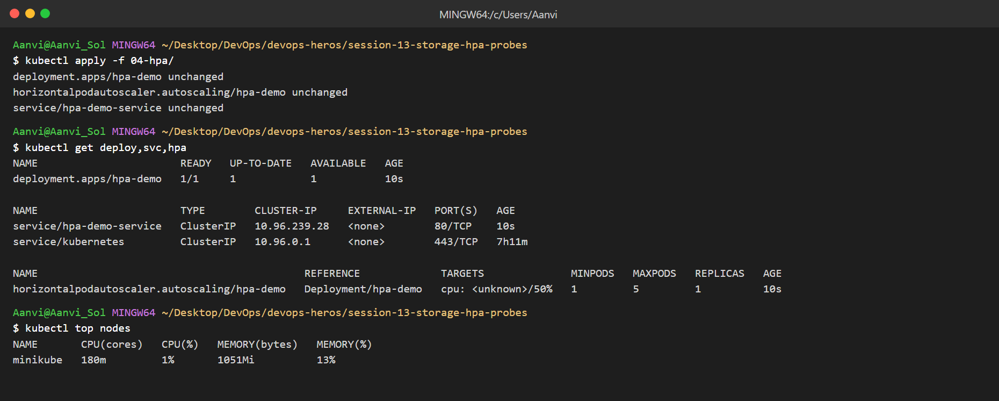

### Load generator

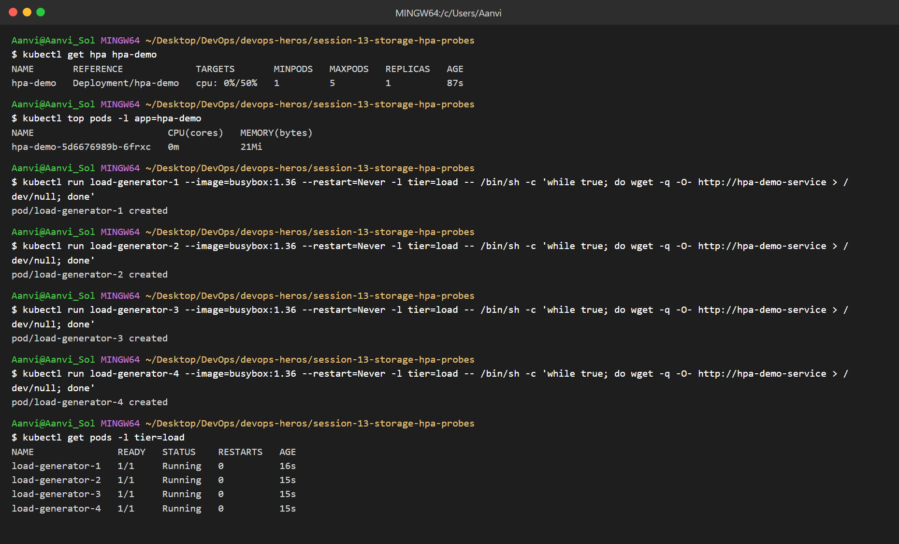

### CPU utilization and scaling

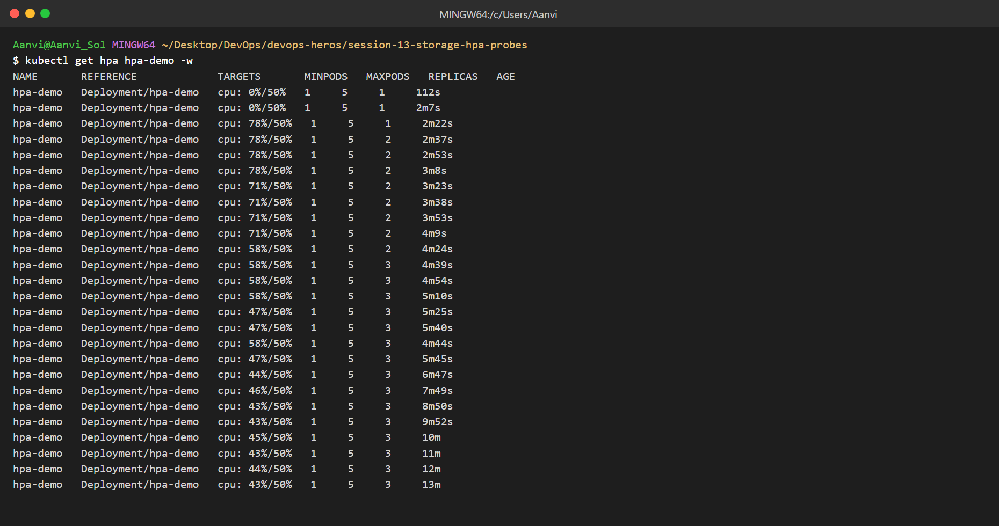
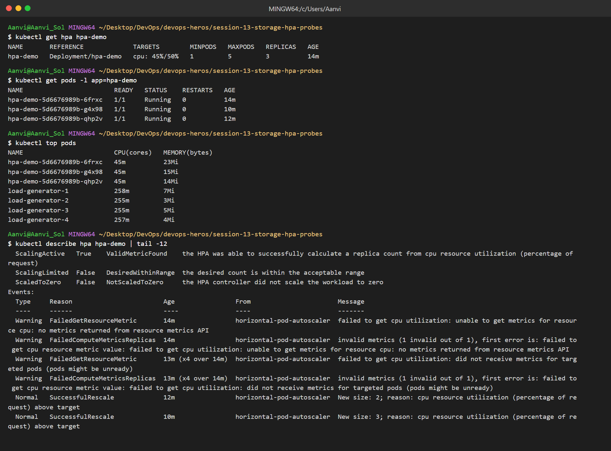

### Scale down after load stops

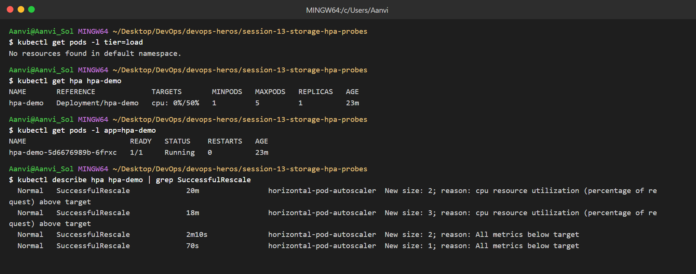

## Probes

### Liveness

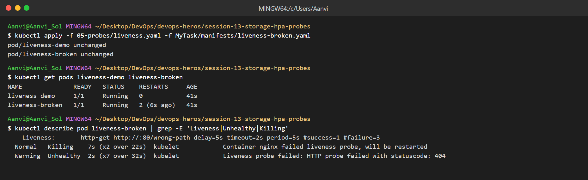

### Readiness

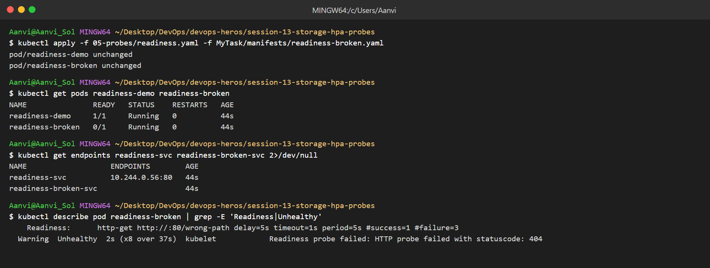

### Startup

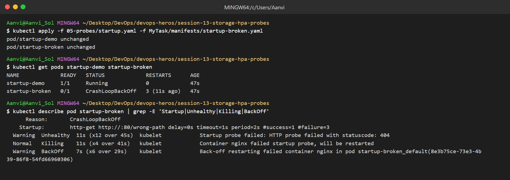

## Task 3: Mini Project

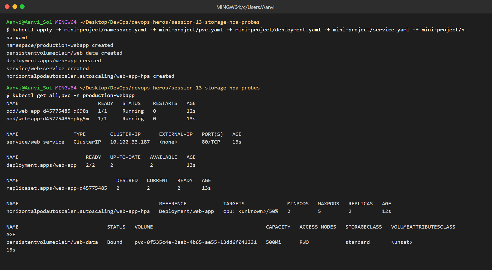

### Data persists after pod delete

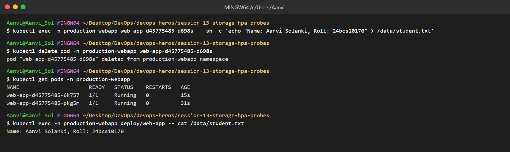

### Access the app

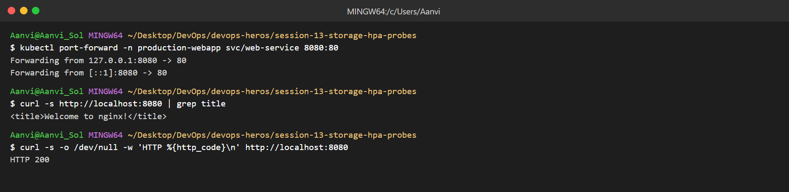
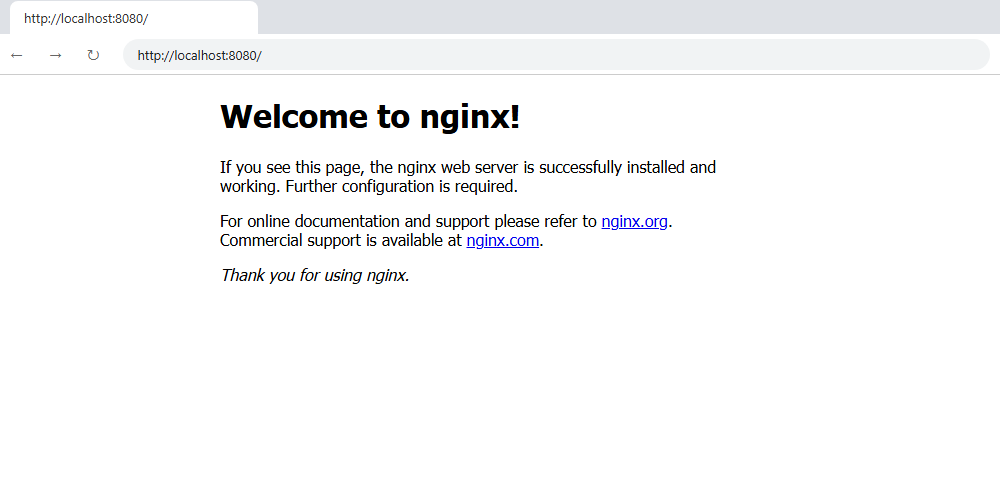
