# Kubernetes Troubleshooting

Name: Aanvi Solanki     Roll no.: 24bcs10170        Group: A

## Task 1: Kubernetes Commands

### kubectl get

### kubectl describe

### kubectl logs

### kubectl exec

### kubectl events

### kubectl get -o wide, top, explain

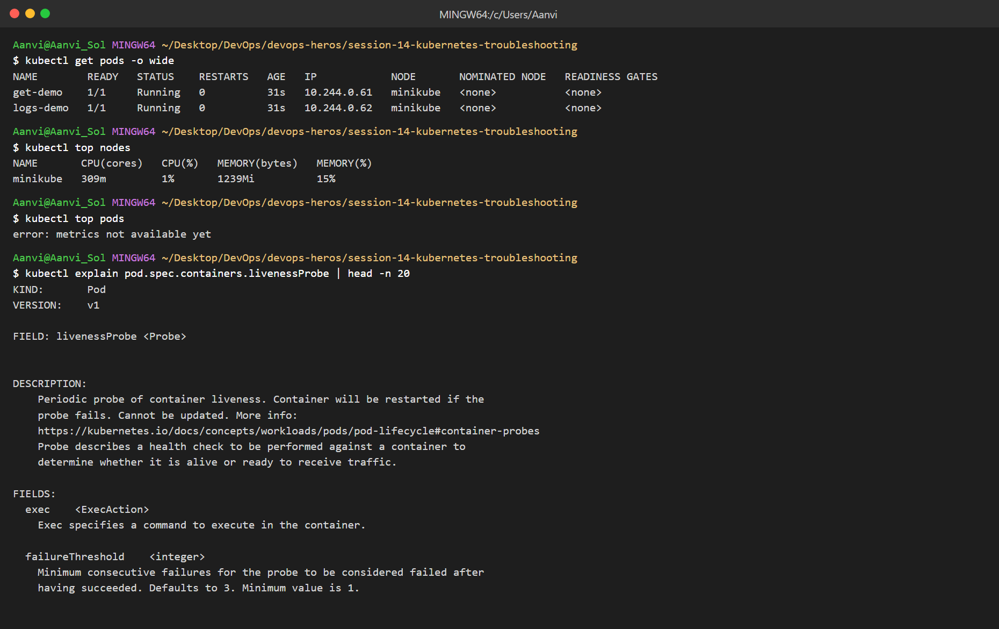

## Task 2: Troubleshoot Common Issues

### CrashLoopBackOff

* Root cause: app exits with code 1. Fix: corrected command.

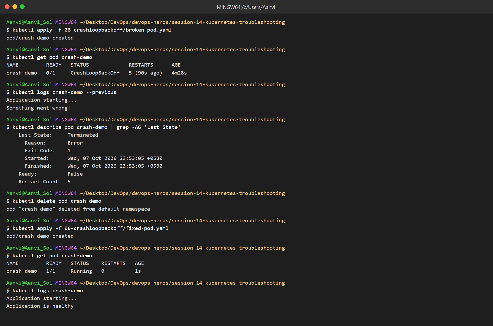

### ImagePullBackOff / ErrImagePull

* Root cause: image tag does not exist. Fix: valid tag `nginx:1.27`.

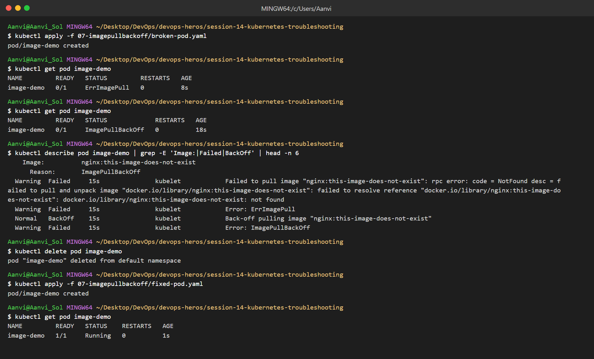

### Pending

* Root cause: nodeSelector matches no node. Fix: removed nodeSelector.

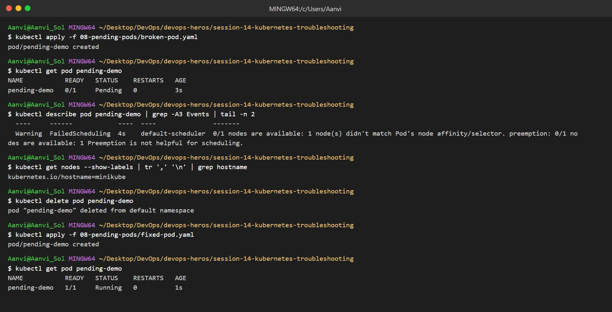

### ContainerCreating

* Root cause: mounted ConfigMap missing. Fix: created the ConfigMap.

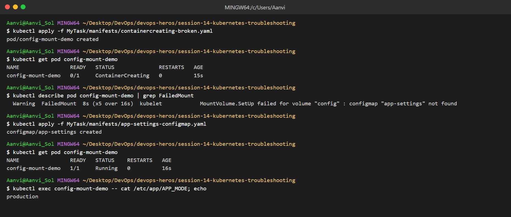

### Service connectivity

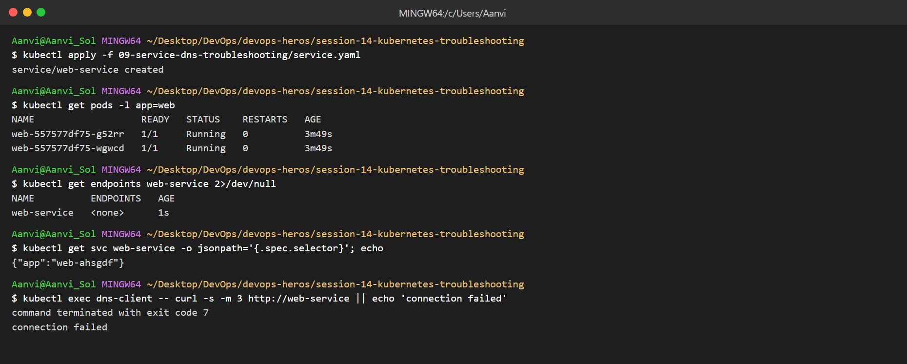

* Root cause: Service selector `app: web-ahsgdf` matches no pods (ENDPOINTS `<none>`). Fix: selector `app: web`.

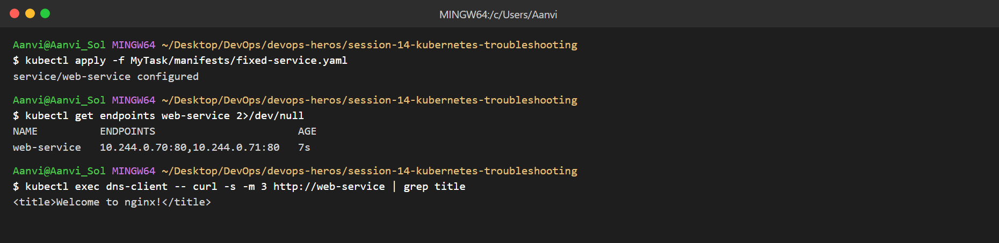

### DNS

* Root cause: wrong service name. Fix: use `<service>.<namespace>.svc.cluster.local`.

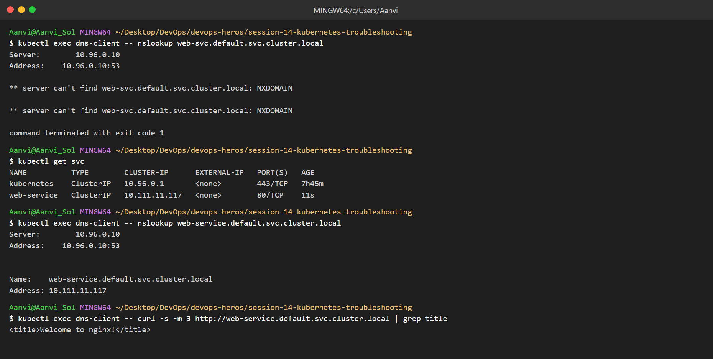

### Pod networking

* Root cause: Service `targetPort: 8080` but nginx listens on 80. Fix: `targetPort: 80`.

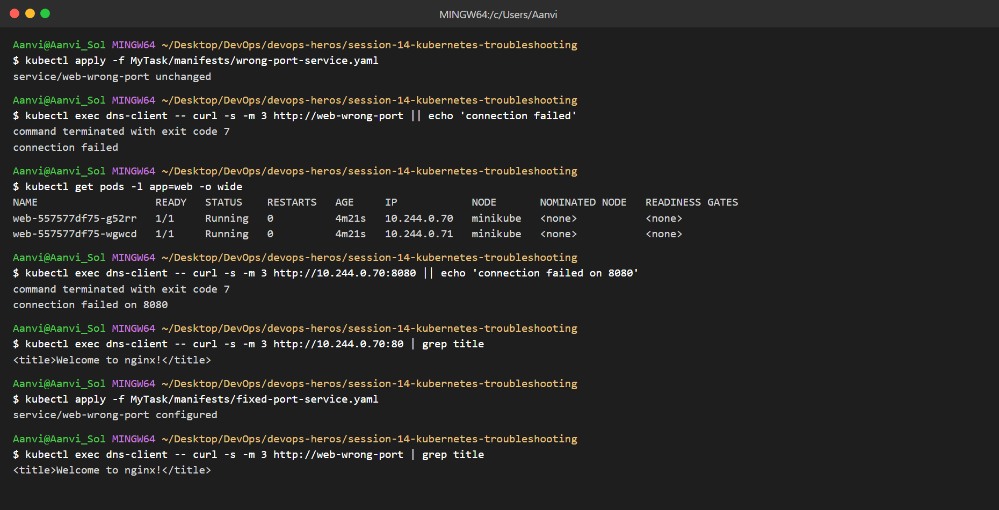

### Configuration issue

* Root cause: env refers to key `MODE`, but the ConfigMap key is `APP_MODE` (CreateContainerConfigError). Fix: correct key.

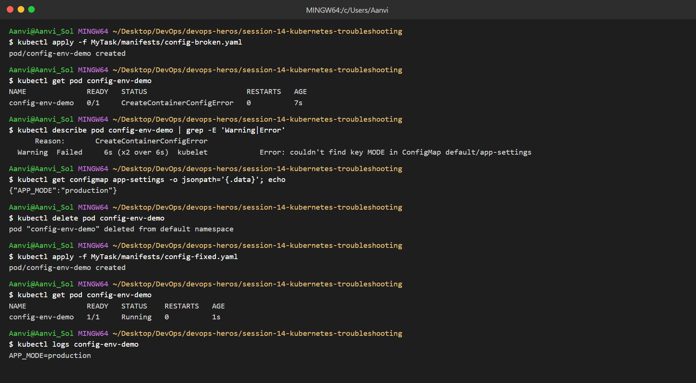

### Triage gauntlet (scenarios 1-5)

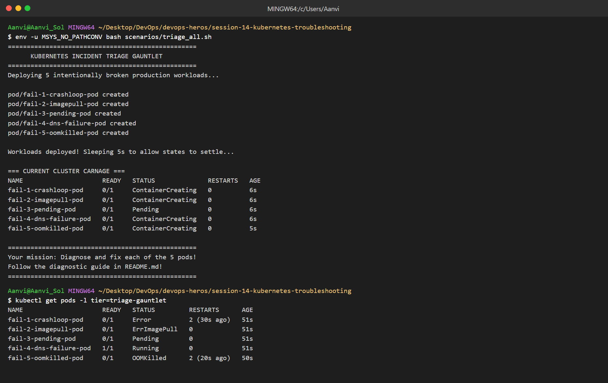

| Scenario | Problem | Root cause | Fix |
|---|---|---|---|
| 1 | CrashLoopBackOff | `DATABASE_URL` env missing, exit 1 | Added env |
| 2 | ImagePullBackOff | Image does not exist | Valid image |
| 3 | Pending | Requests 500 CPU / 1000Gi | Realistic requests |
| 4 | DNS failure | Wrong service name/namespace | Correct FQDN |
| 5 | OOMKilled (exit 137) | 20Mi memory limit | Limit 256Mi |

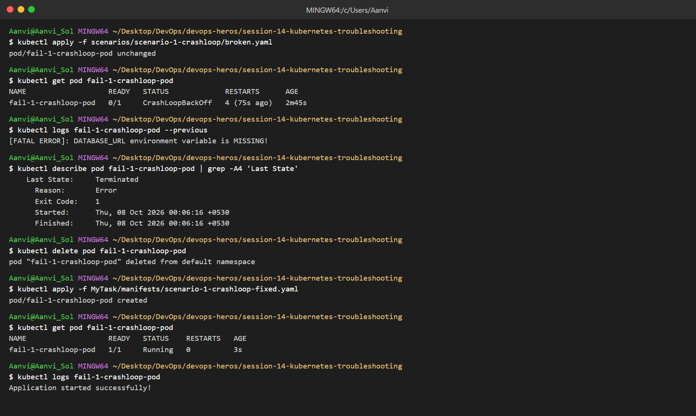
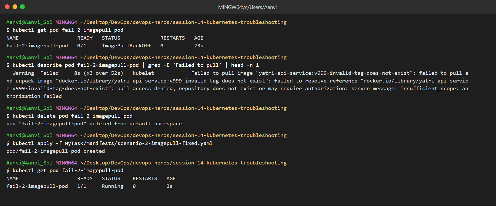
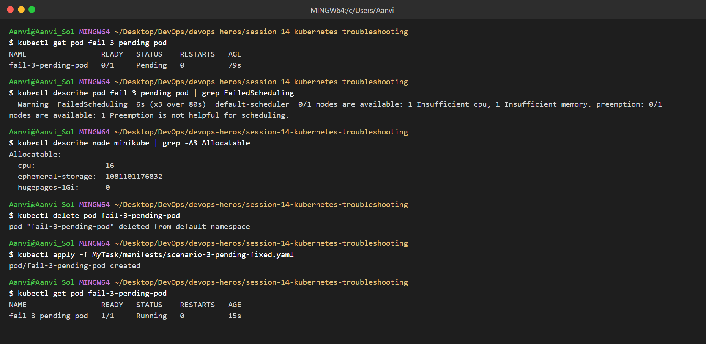
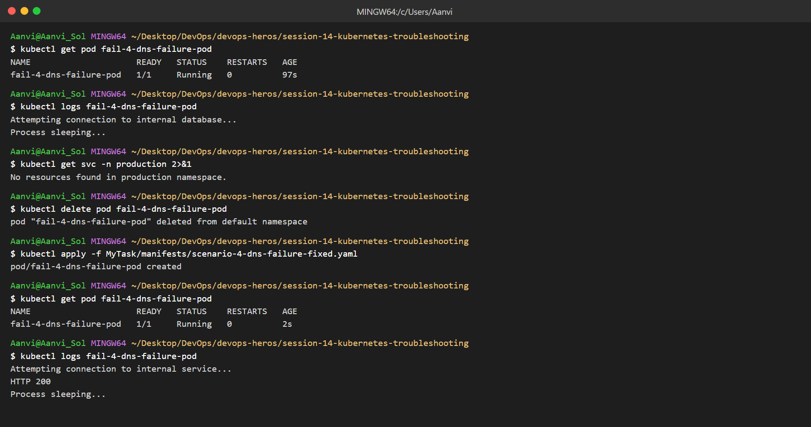
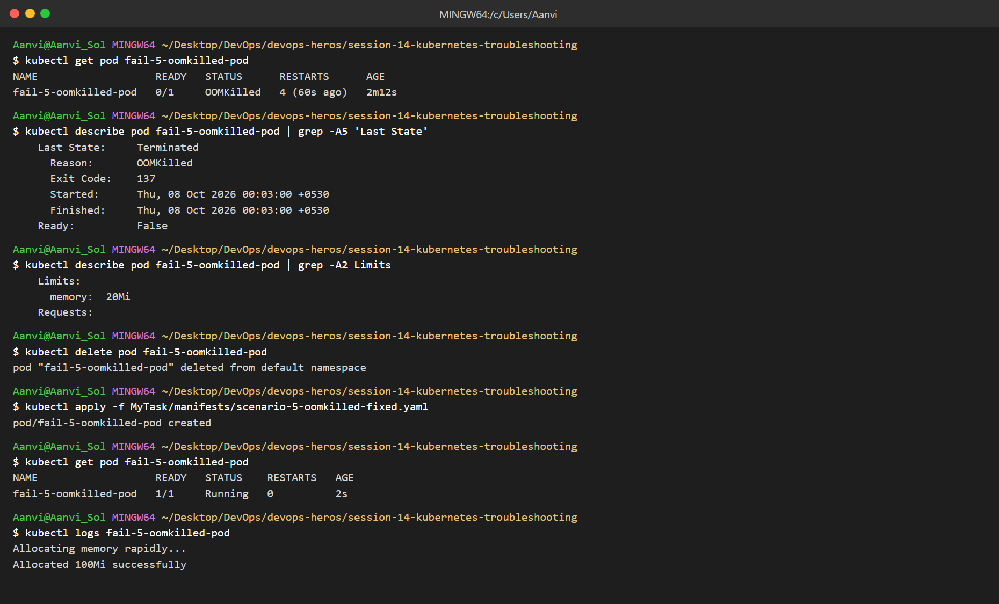

## Task 3: Mini Project

### Deploy and verify

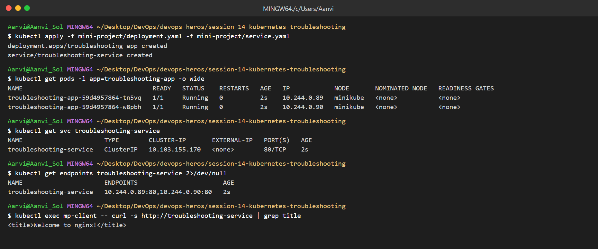

### Broken pod - investigate and fix

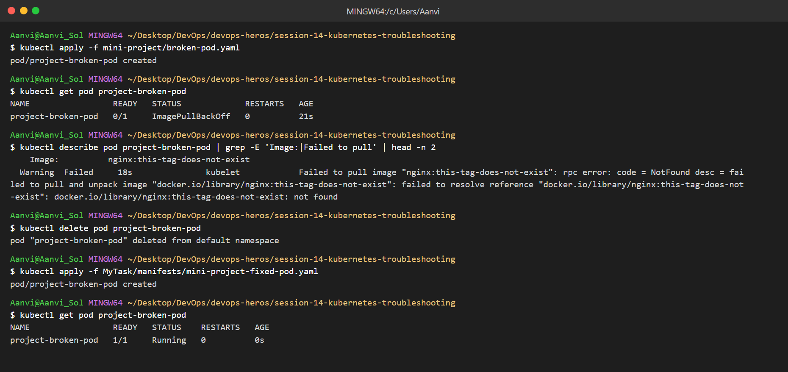
