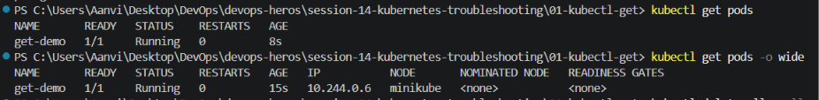
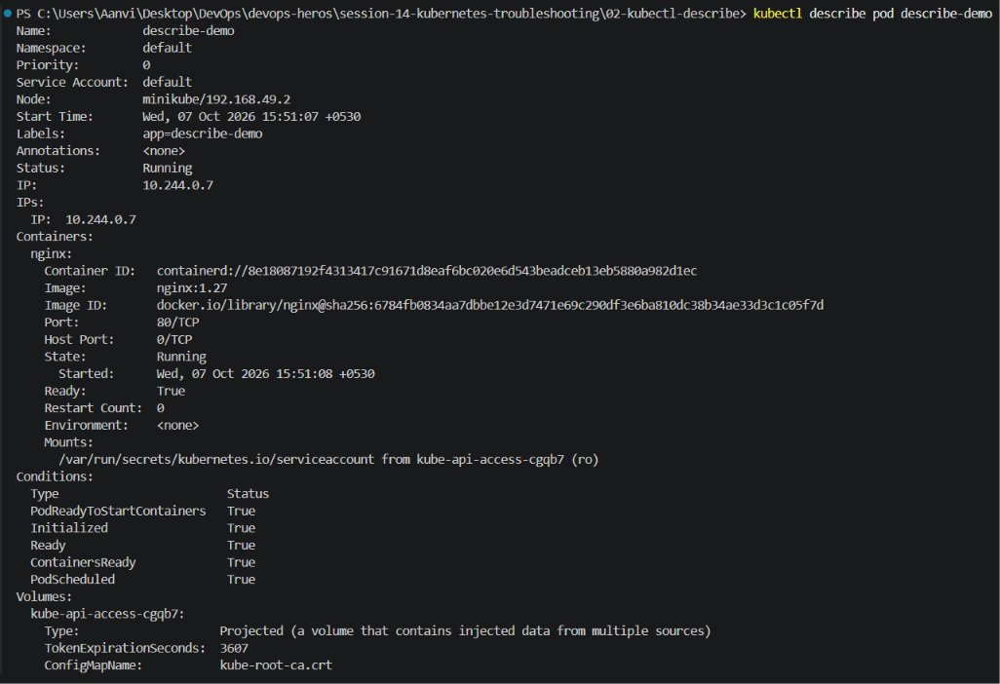
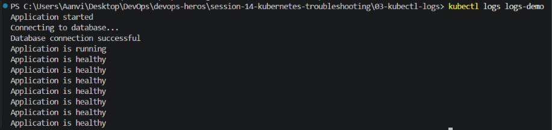
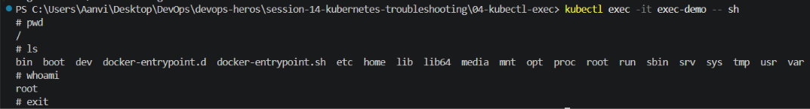
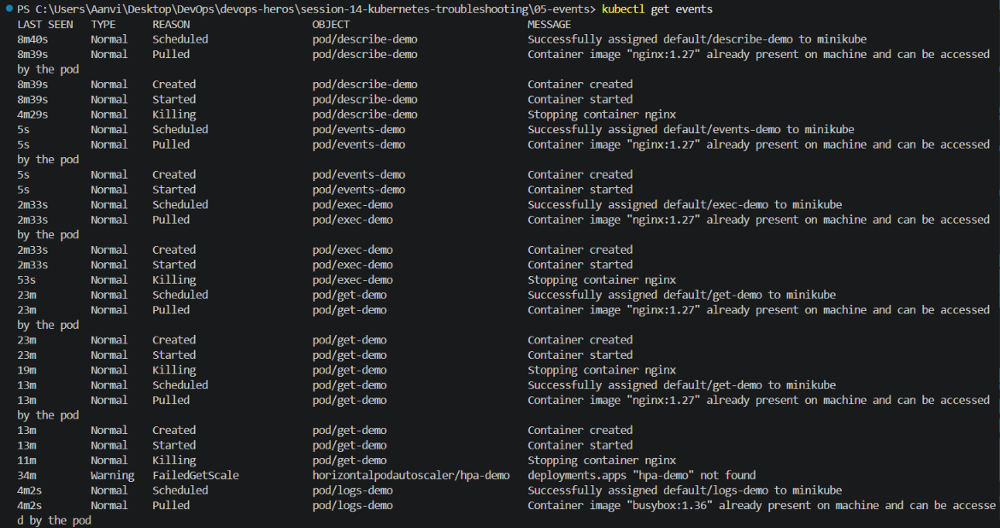
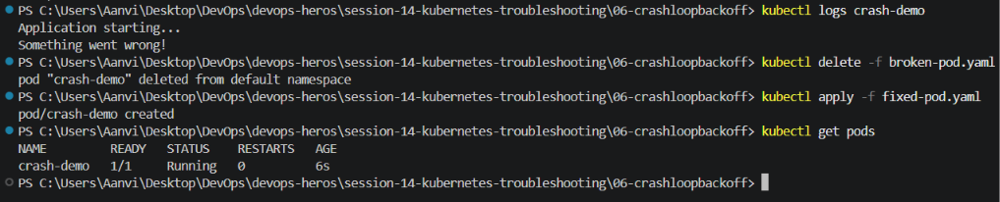
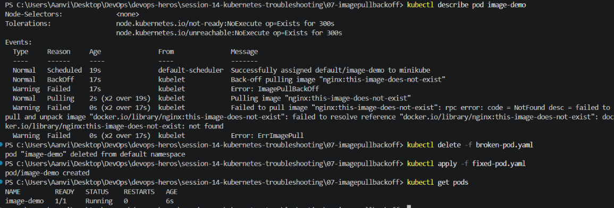
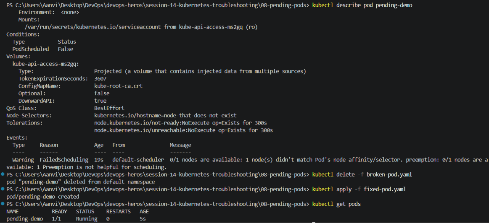

# Kubernetes Troubleshooting

## Task 1

### kubectl get

Purpose:
Used to list Kubernetes resources.

Commands Used:
kubectl get pods
kubectl get pods -o wide

Observation:
The pod was successfully created and its status was Running.

### kubectl describe

Purpose:
Provides detailed information about a Kubernetes resource.

Information Observed:
- Events
- IP Address
- Image
- Status
- Container Information

### kubectl logs

Purpose:
Displays application logs from a container.

Result:
Successfully viewed logs generated by the container.

### kubectl exec

Purpose:
Execute commands inside a running container.

Commands Executed:
pwd
ls
whoami

Result:
Successfully accessed the container shell.

### kubectl get events

Purpose:
Displays Kubernetes cluster events.

Observation:
Events showed pod scheduling, image pulling and container startup.

## Task 2

### CrashLoopBackOff

### ImagePullBackOff

### Pending

