# Helm

Name: Aanvi Solanki     Roll no.: 24bcs10170        Group: A

## What is Helm?

* Package manager for Kubernetes - apps are packaged as Charts.
* Benefits: reusable templates, easy upgrades and rollbacks, version history, per-environment values.

## Task 1: Helm Commands

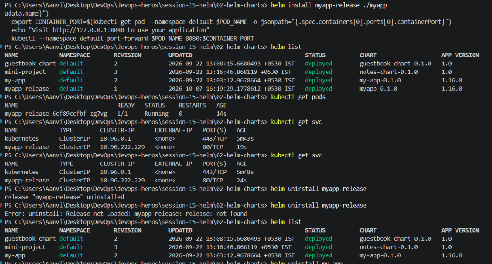

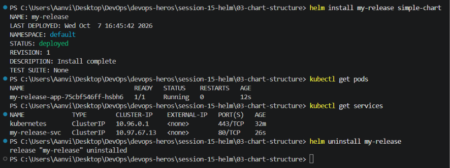

### helm repo, helm search

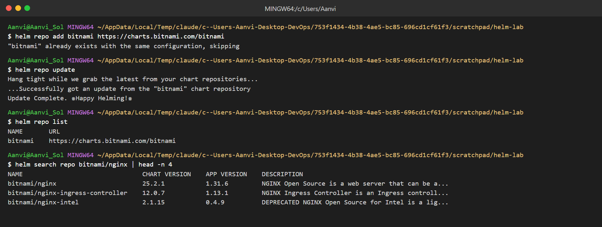

### helm create, lint, template

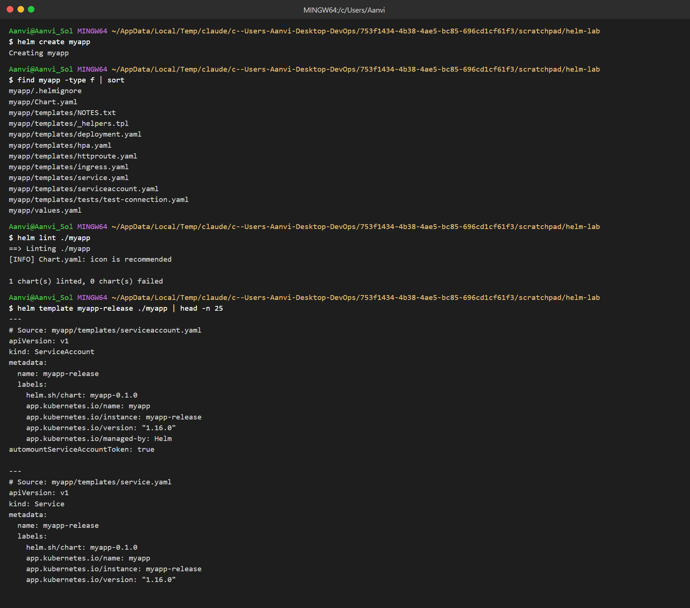

### helm install, list, status

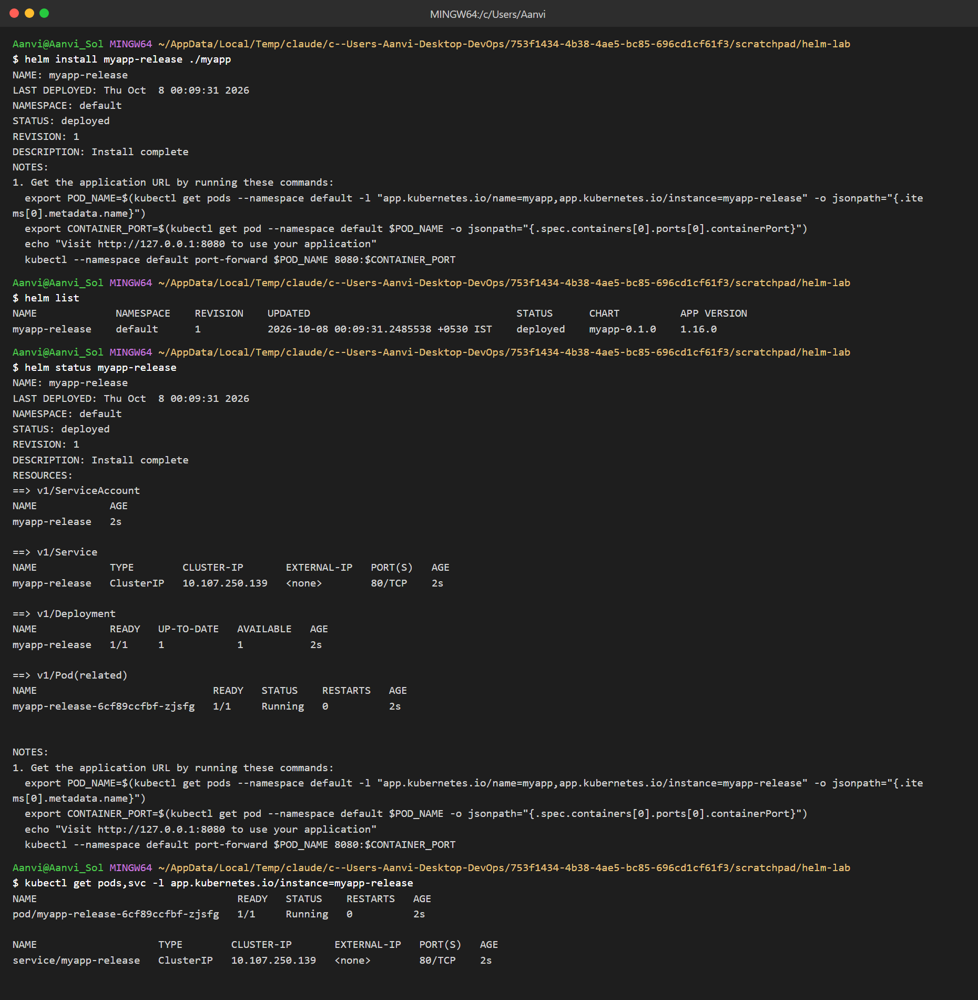

### helm get

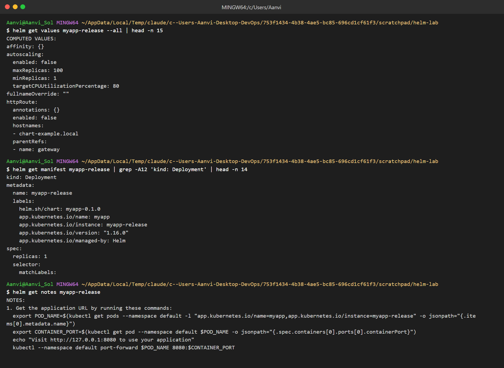

### helm uninstall

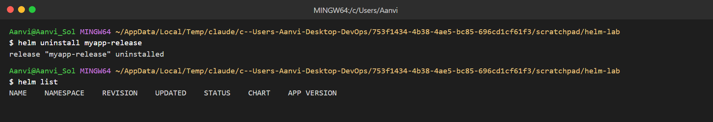

## Task 2: Helm Rollback

Install (nginx 1.24) → Upgrade (nginx 1.25) → Verify → Upgrade again (bad tag) → Verify → Rollback to 2 → Verify

### Install, upgrade, verify

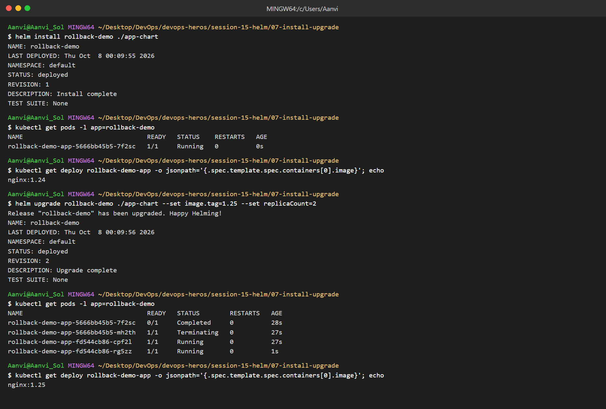

### Upgrade again with bad image

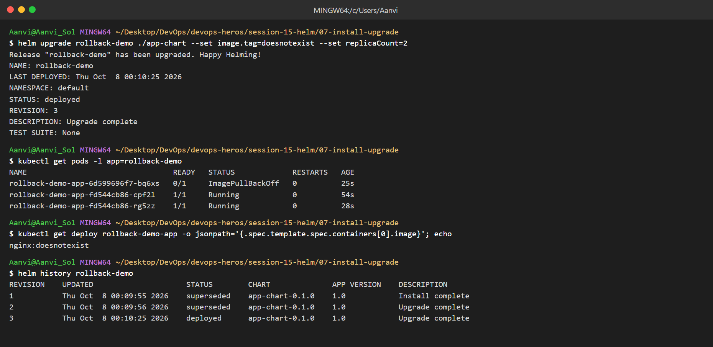

### Rollback and verify

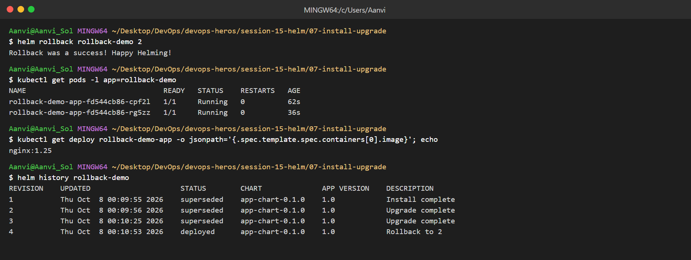
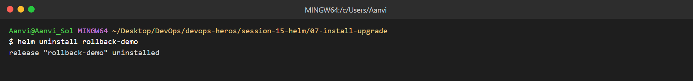

## Task 3: Mini Project (notes-chart)

### Lint and template

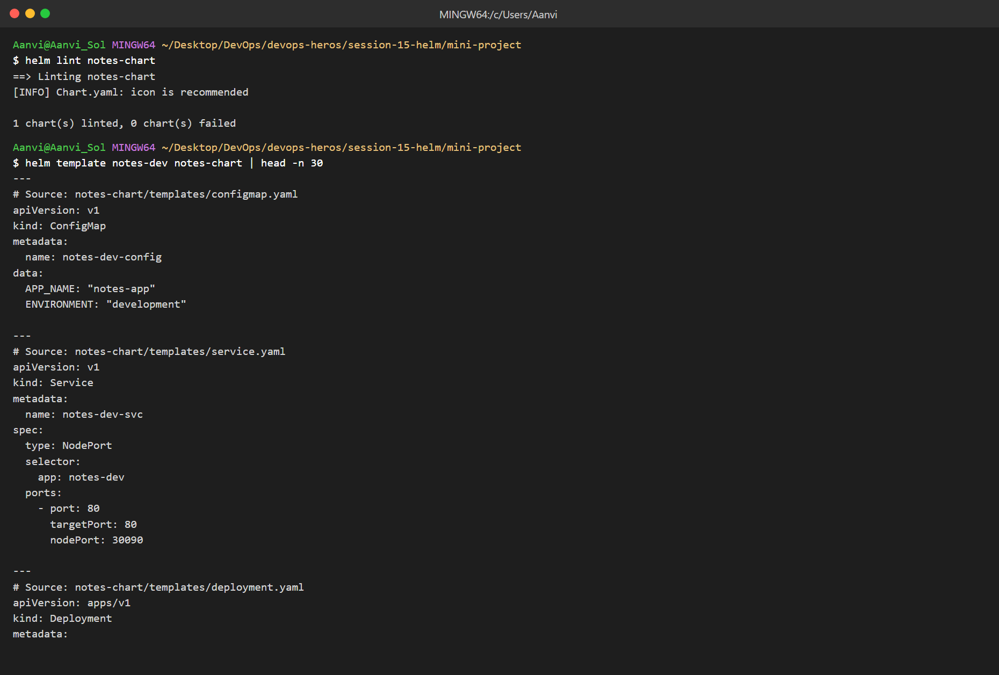

### Install

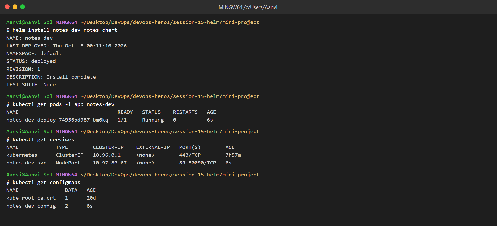

### Upgrade with production values

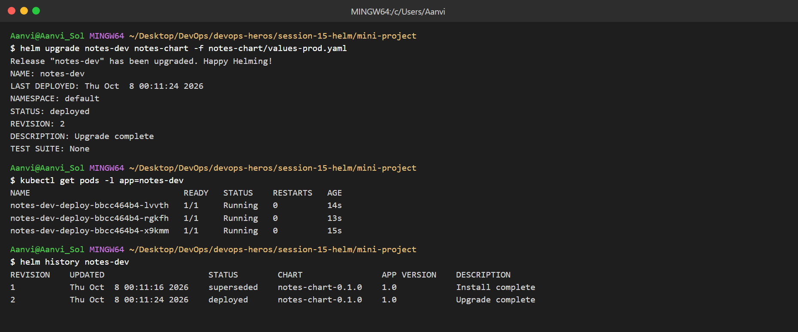

### Break and rollback

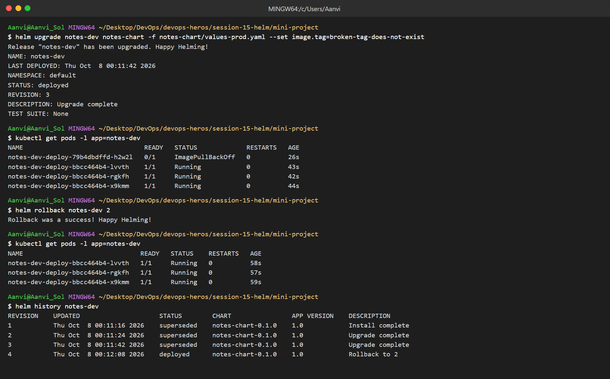

### Uninstall

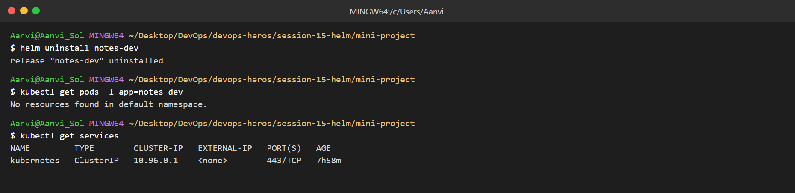
