# Github Actions

Name: Aanvi Solanki     Roll no.: 24bcs10170        Group: A

Demo project: [demo-project](demo-project/) - Workflow: [session16-cicd.yml](../../.github/workflows/session16-cicd.yml)

## Concepts

| Term | Meaning |
|---|---|
| CI | Every push is automatically built and tested |
| CD | Tested code is automatically packaged and deployed |
| Pipeline | Ordered stages: test → build → docker → deploy |
| Workflow | YAML file in `.github/workflows/` |
| Job | Group of steps on one runner (`test`, `build`, `docker`, `deploy`) |
| Step | One command or action inside a job |
| Runner | Machine that runs the job (`ubuntu-latest`) |
| Secrets | Encrypted values, e.g. `secrets.GITHUB_TOKEN` for GHCR login |
| Artifacts | Files saved from a run (`calculator-build`) |

## Run locally

### Test

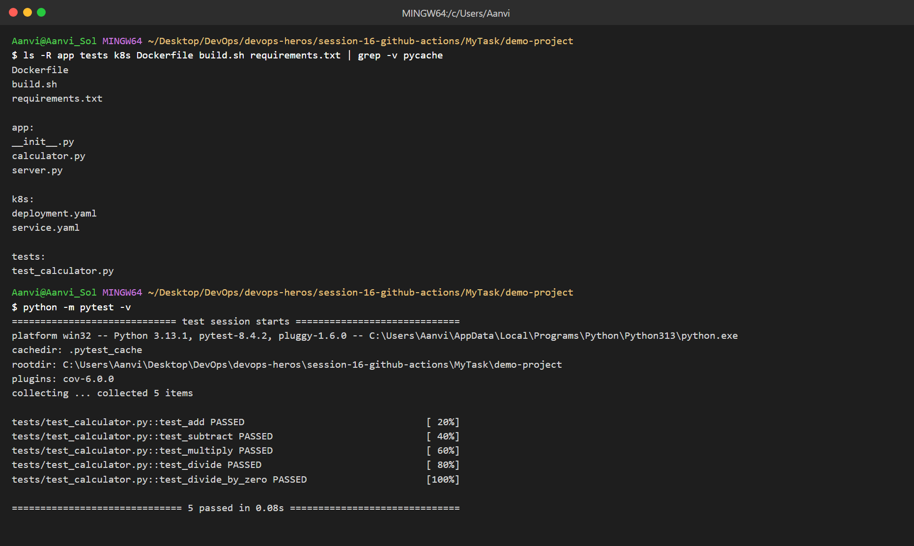

### Build

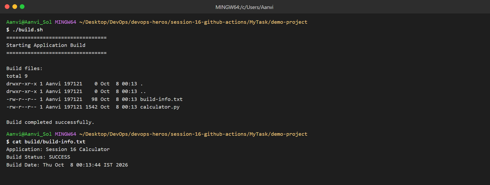

### Docker

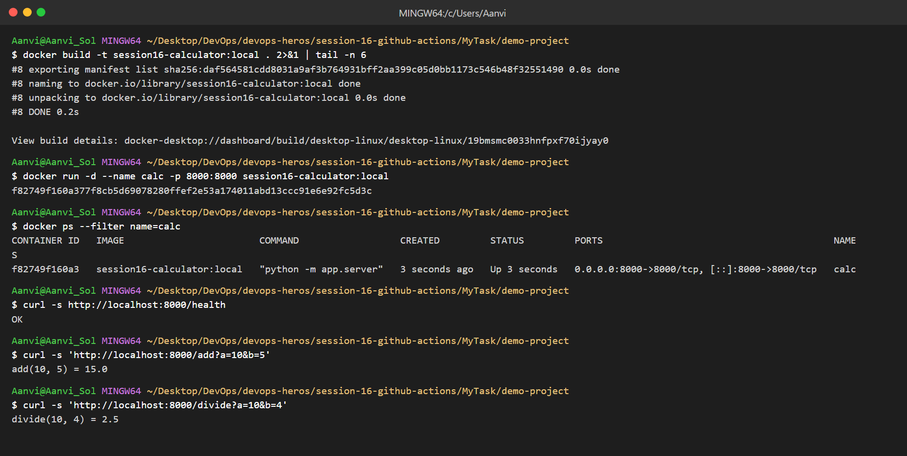
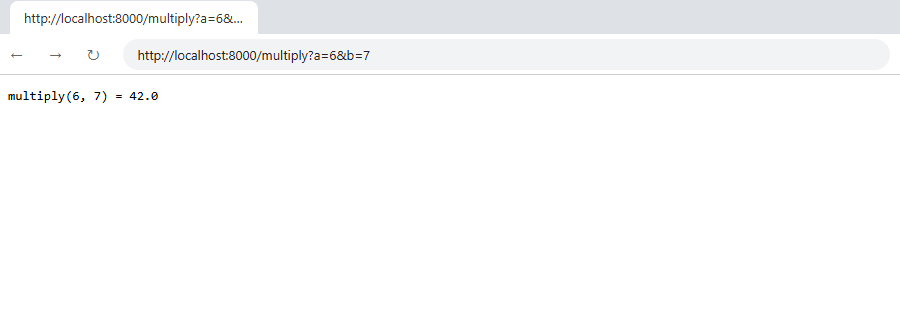

## GitHub Actions Workflow

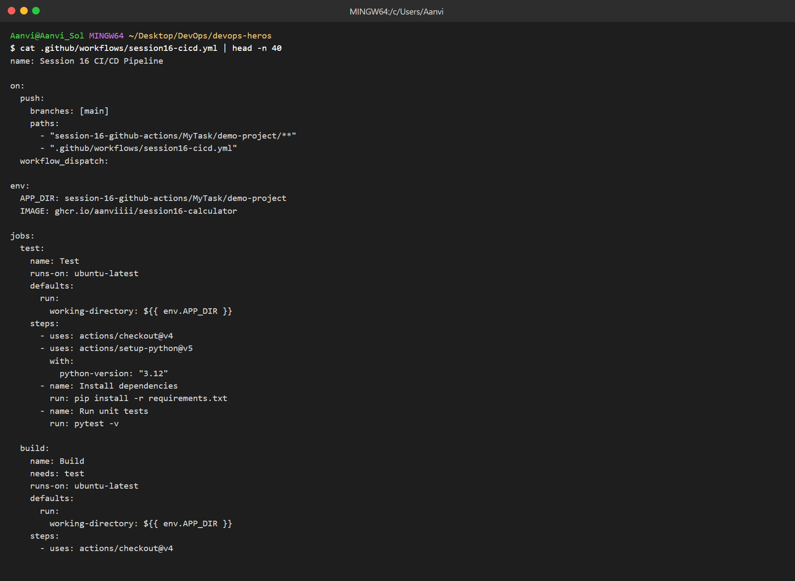

## Pipeline Execution

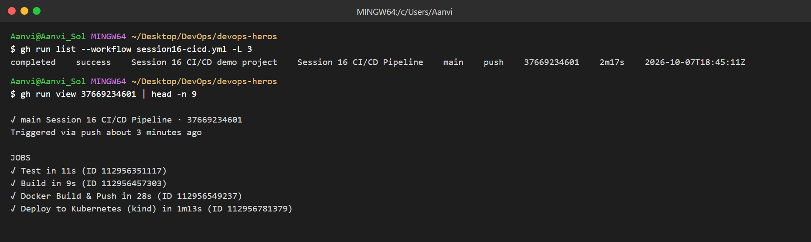
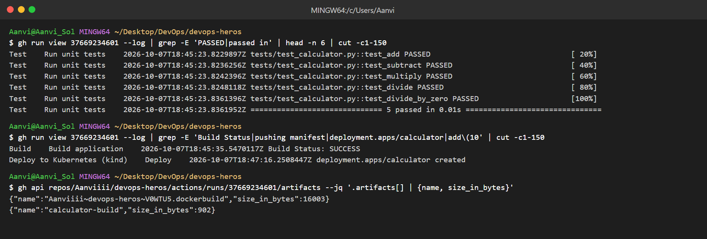
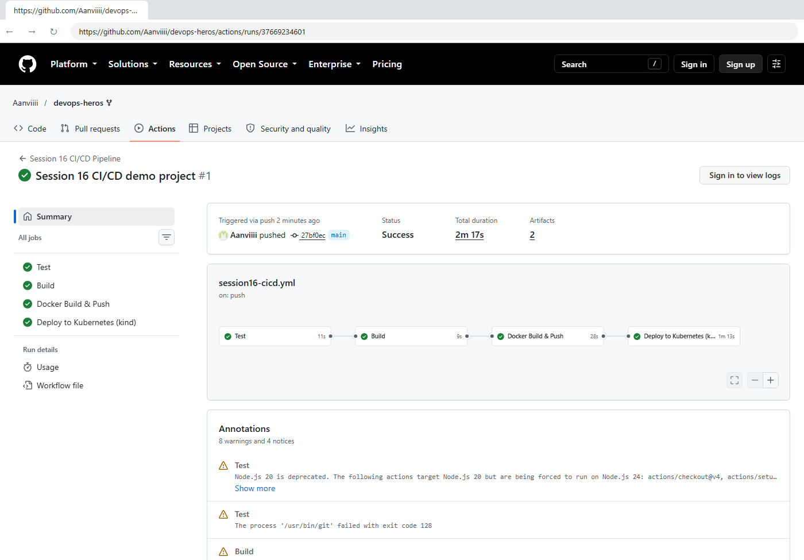
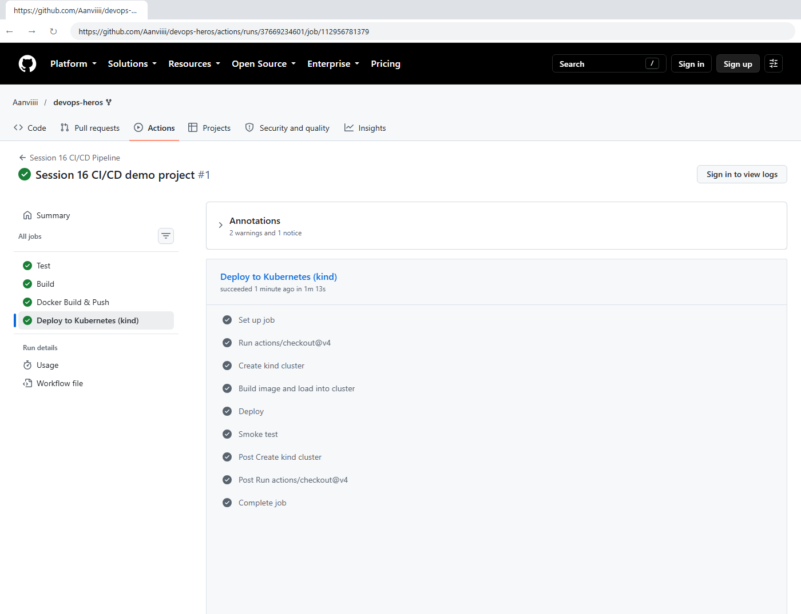
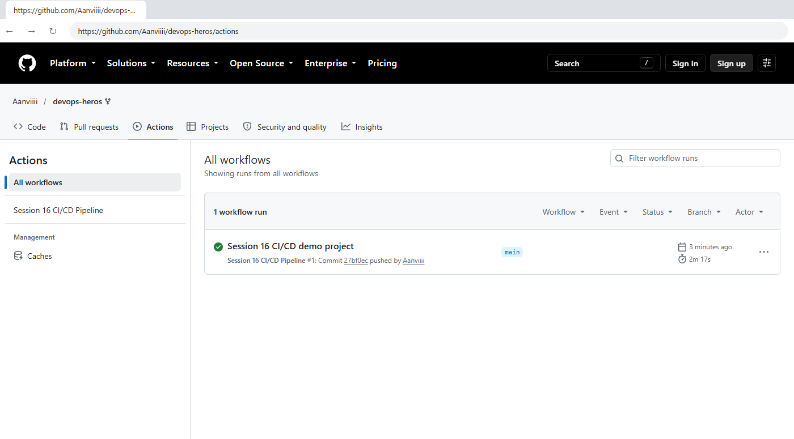

## Earlier practice (aanvi-cicd)

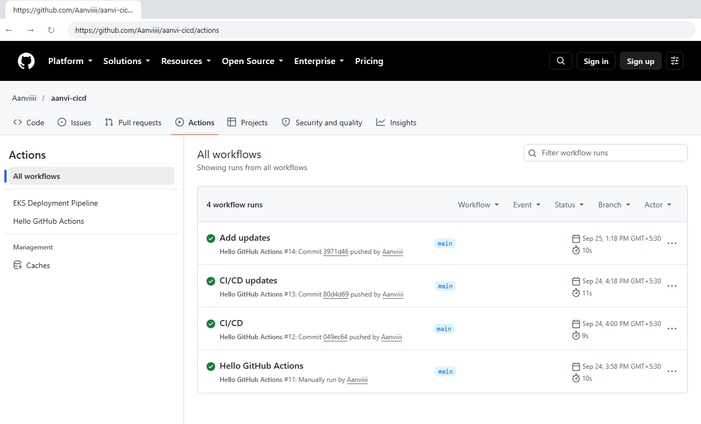
