# DevSecOps

Name: Aanvi Solanki     Roll no.: 24bcs10170        Group: A

Project: [devsecops-project](devsecops-project/) - Workflow: [session17-devsecops.yml](../../.github/workflows/session17-devsecops.yml)

## Pipeline Flow

Code → Build → Unit Test → SAST → SCA → Secret Scan → Docker Build → Image Scan → Security Gate → Push Image → Deploy to Kubernetes

| Stage | Tool |
|---|---|
| Unit test | pytest + coverage |
| SAST | CodeQL |
| SCA | pip-audit |
| Secret scanning | Gitleaks |
| Container image scanning | Trivy |
| Security gate | Trivy `exit-code: 1` on fixable CRITICAL |
| Container registry | GitHub Container Registry (GHCR) |
| Kubernetes deployment | kind cluster in the runner |

## Build & Unit Test

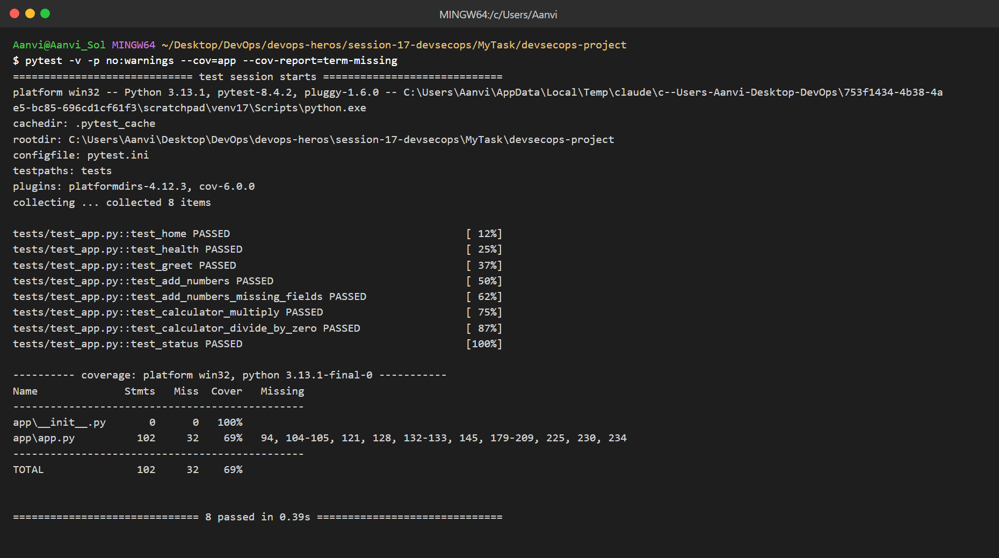

## SCA - Dependency Scan

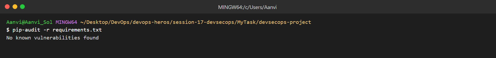

## Secret Scanning

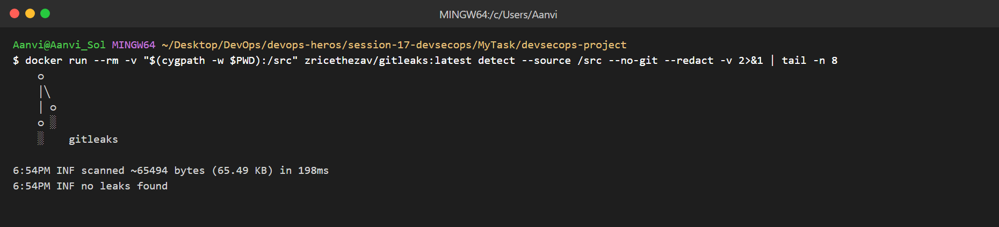

## Docker Build

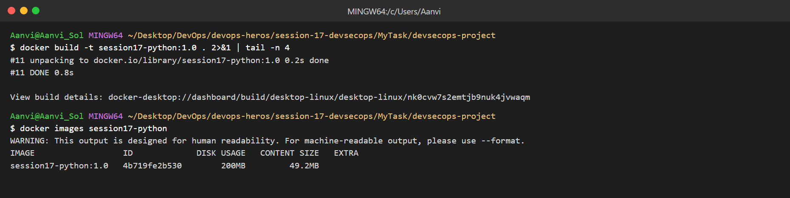
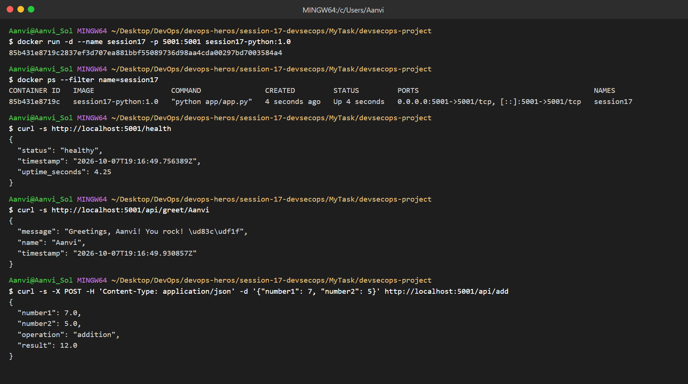
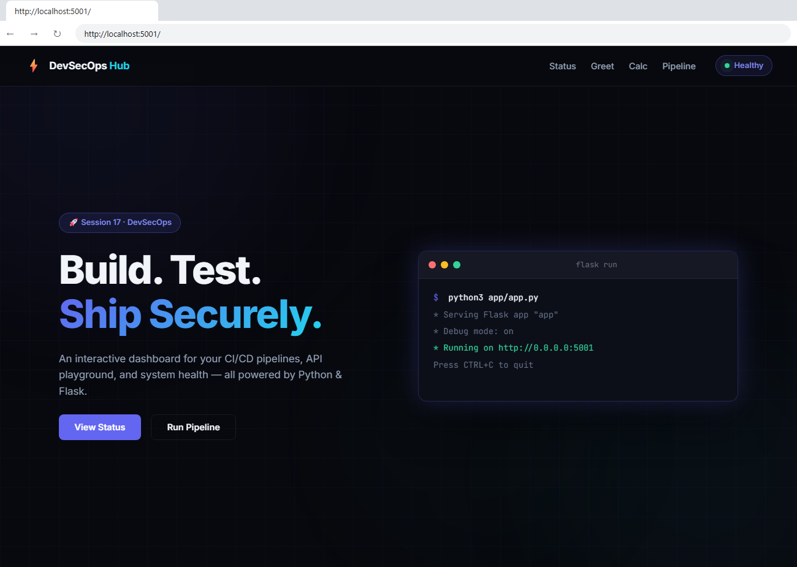

## Container Image Scan & Security Gate

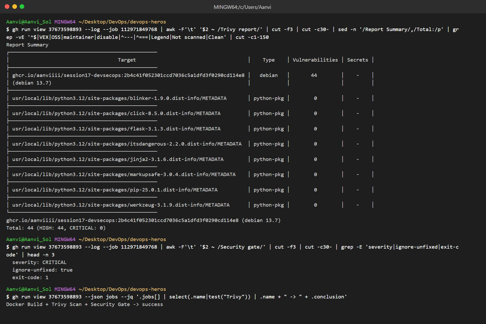

## Kubernetes Deployment

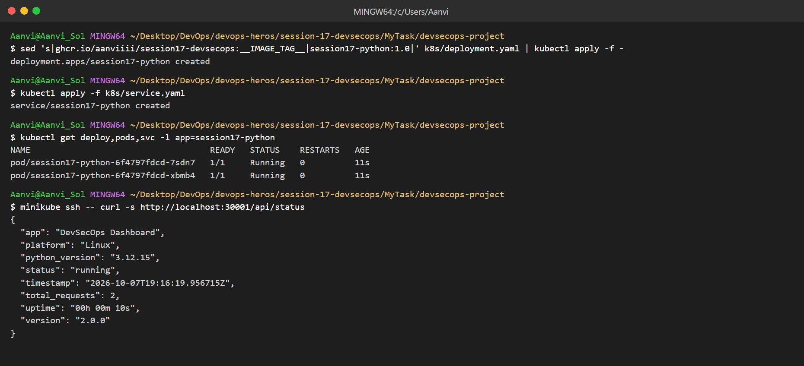

## DevSecOps Pipeline

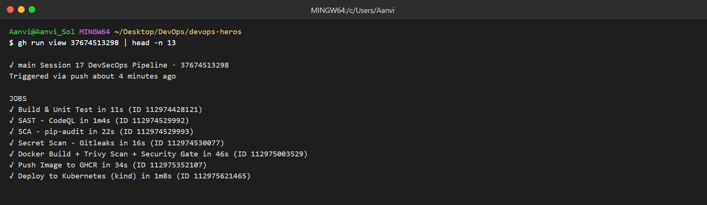
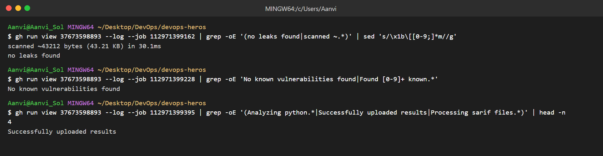
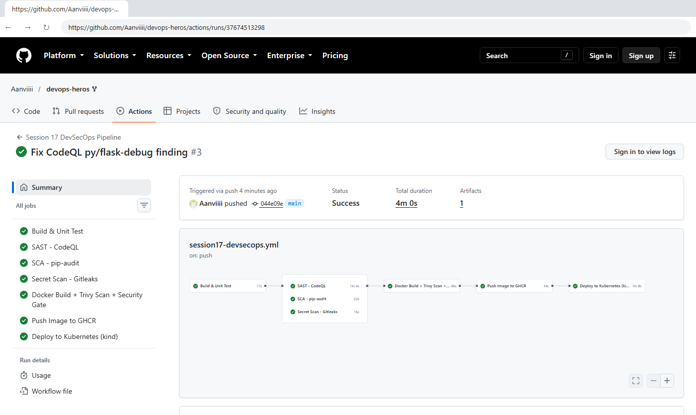

## SAST - CodeQL finding and fix

* CodeQL flagged `app.run(debug=True)` on `0.0.0.0` (`py/flask-debug`, high).
* Fix: debug only when `FLASK_DEBUG=1`. Alert closed on the next run.

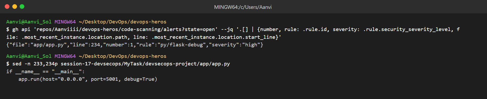
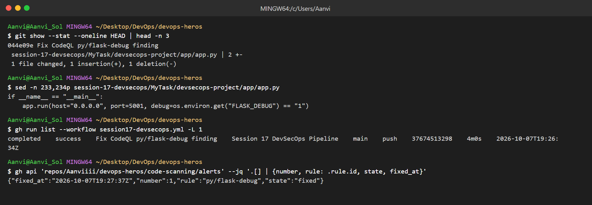

## Push Image & Deploy

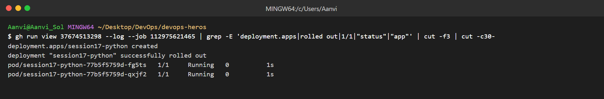
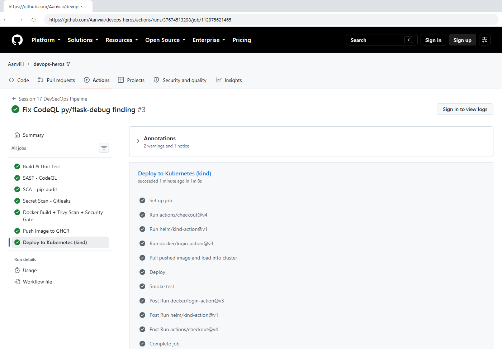
