# Kubernetes Pods, ReplicaSets & Deployments

Name: Aanvi Solanki     Roll no.: 24bcs10170        Group: A

## Cluster Health

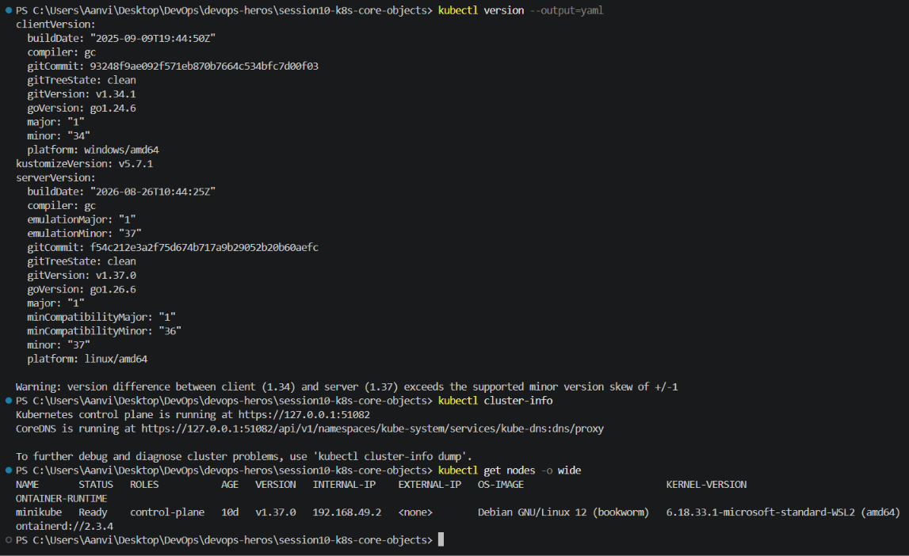

## Pod Deployment

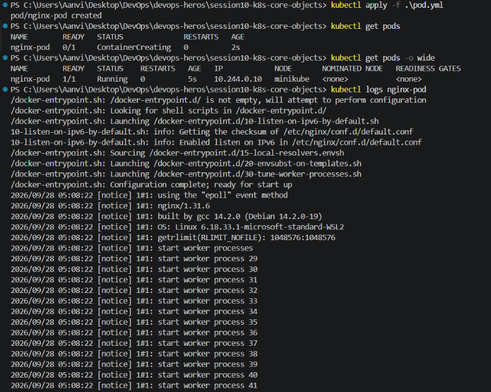
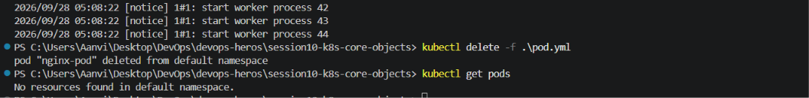

## Error state 

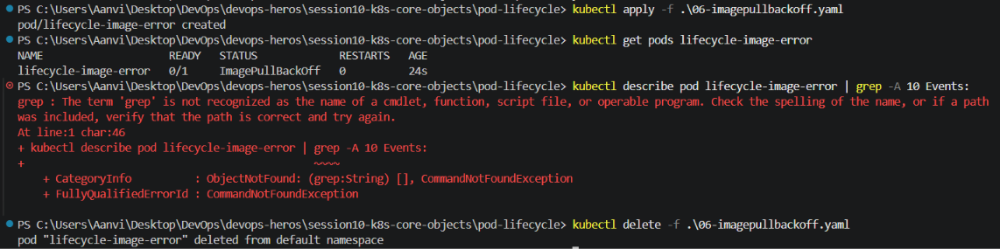

## Transient pod lifecycle

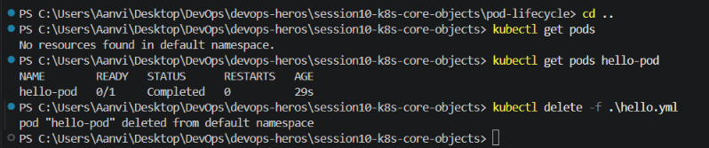
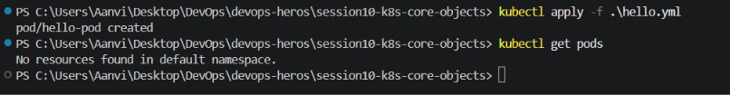

## Pod Lifecycle

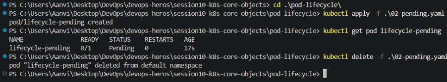

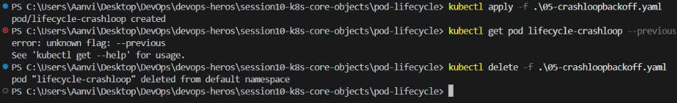

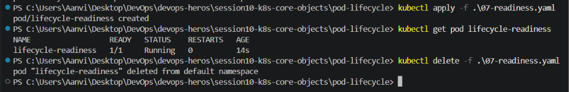

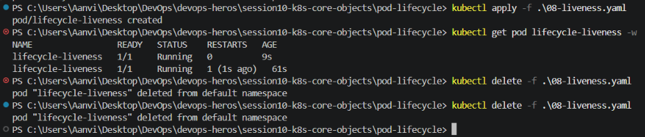

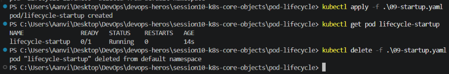

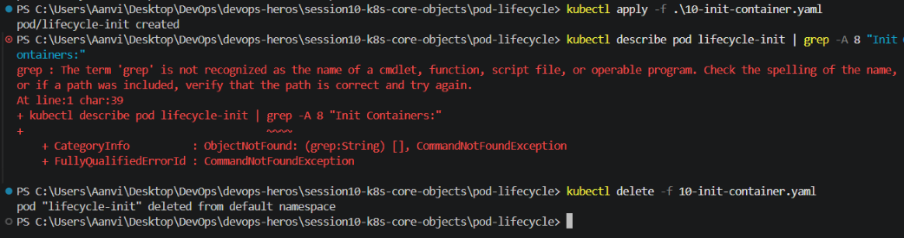

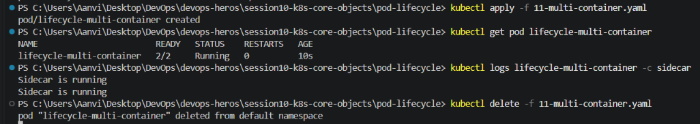

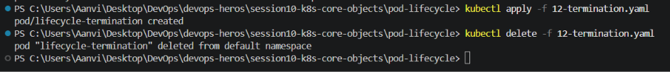

## ReplicaSet

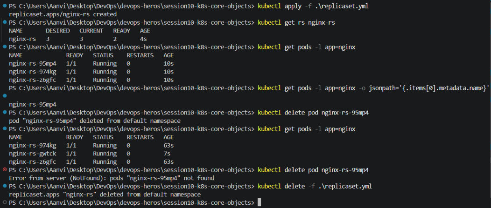

## StatefulSet

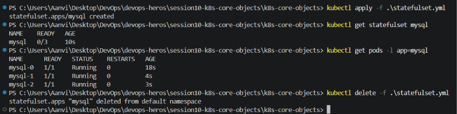

## DaemonSet

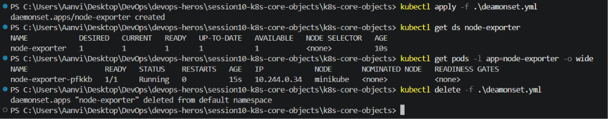

## Rolling updates

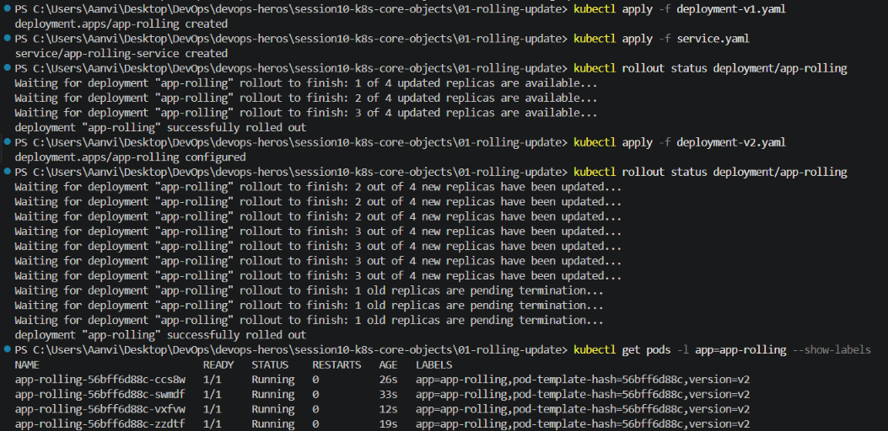
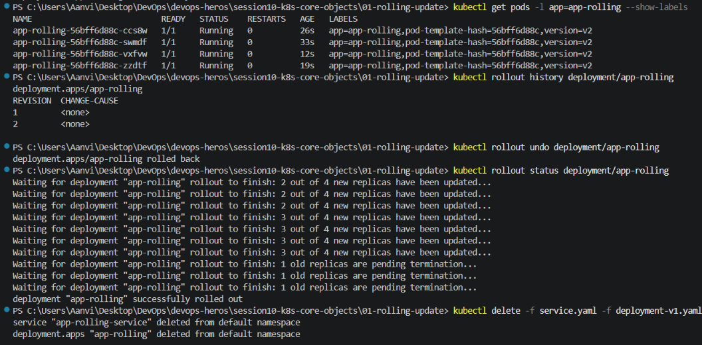

## Troubleshooting

### Broken image
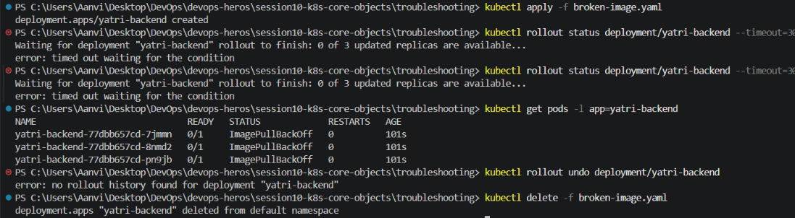

### Immutable selector
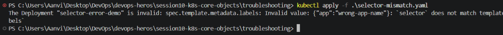

## Blue-green

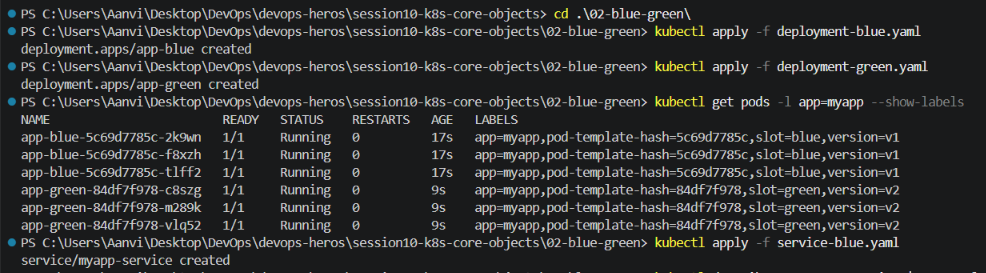
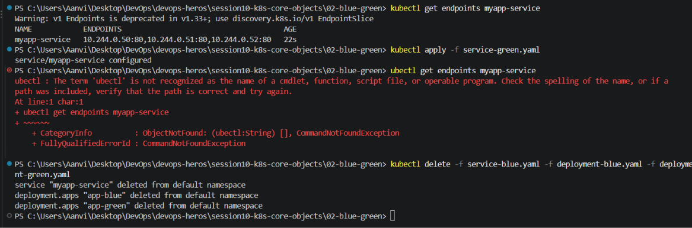

## Canary

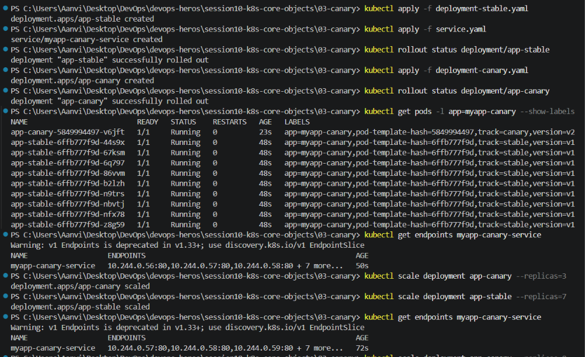
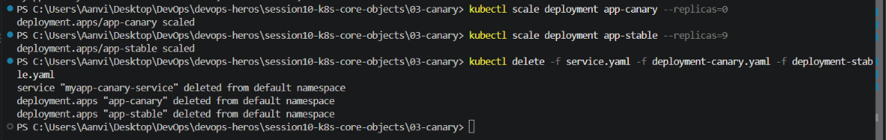

## Recreate

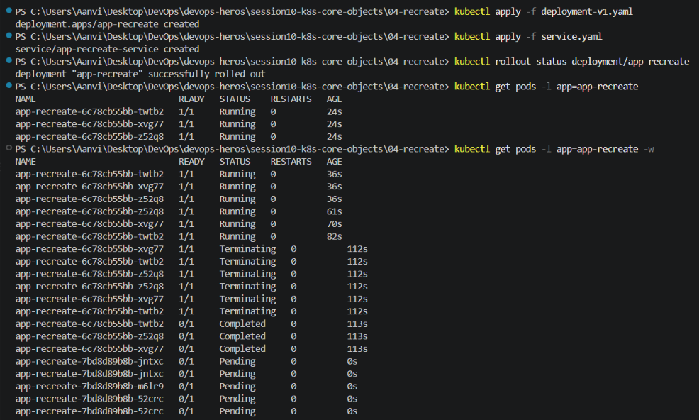
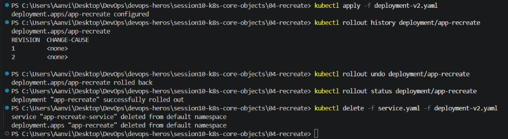