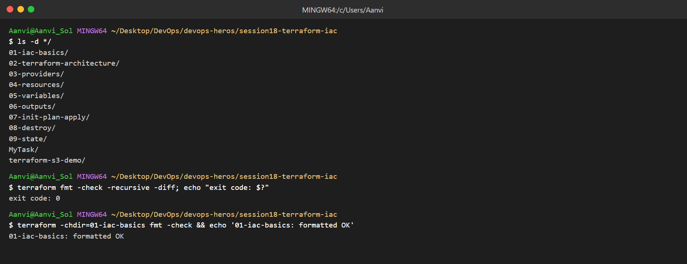
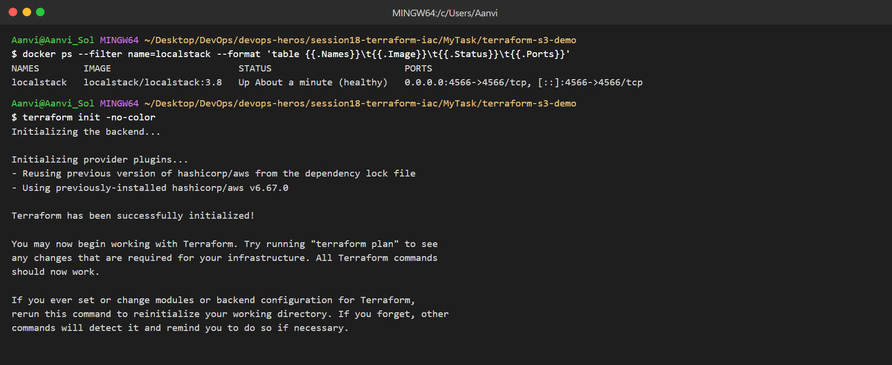
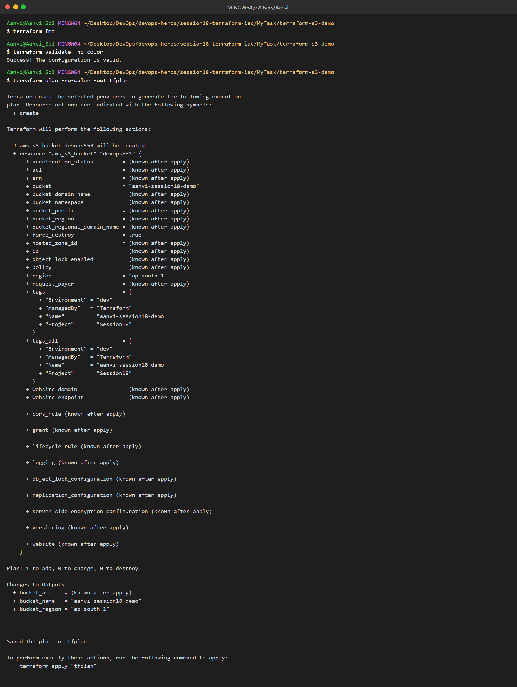
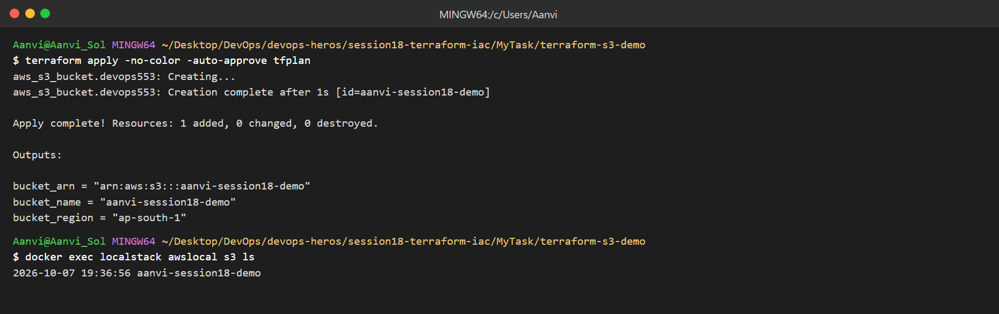
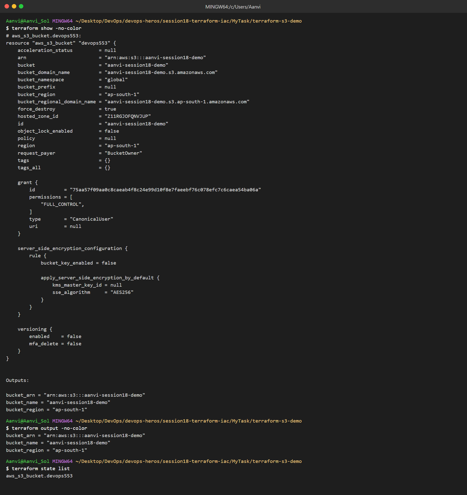
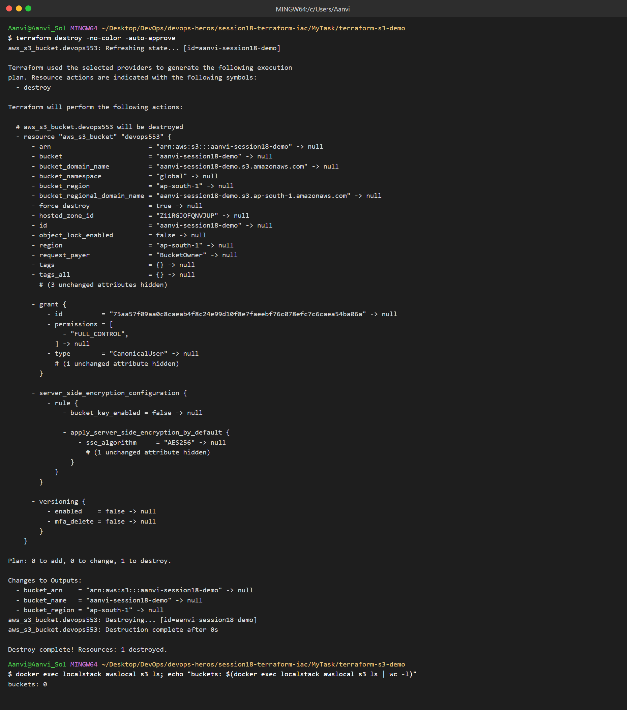
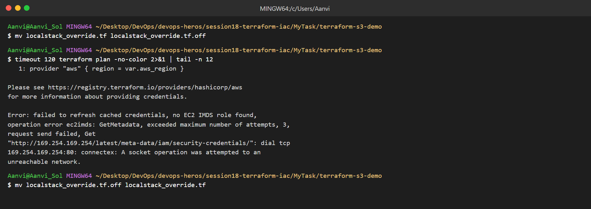

# Terraform & Infrastructure as Code

Name: Aanvi Solanki     Roll no.: 24bcs10170        Group: A

## Task 1: Terraform S3 Demo

Project: [terraform-s3-demo](terraform-s3-demo/)

* No AWS account, so the S3 bucket is created on LocalStack (local AWS emulator) using `localstack_override.tf`.

### terraform fmt (all labs)

### terraform init

### terraform fmt, validate, plan

### terraform apply

### terraform show, output, state

### terraform destroy

### Plan against real AWS (no credentials)

* Without the LocalStack override Terraform needs real AWS credentials, so `plan` stops here.

## Task 2: AWS Services

### 01. IAM - Governance

* Controls who can access what in AWS.
* Users (people/apps), Groups (set of users), Roles (temporary access for services), Policies (JSON permissions).
* Least privilege: give only the permissions needed.
* Best practices: no root usage, MFA, roles instead of access keys, review permissions.
* Use cases: developer access, EC2 accessing S3 through a role.

### 02. EC2 - Compute

* Virtual servers in the cloud.
* AMI: OS image to launch from. Instance types: CPU/RAM size (t3.micro, m5.large).
* Key pairs: SSH login. Security Groups: instance firewall.
* EBS: disk attached to the instance.
* Public IP (internet) vs Private IP (inside VPC).
* Lifecycle: pending → running → stopping → stopped → terminated.
* Use cases: web servers, build servers.

### 03. S3 - Storage

* Object storage. Buckets hold Objects (file + metadata).
* Storage classes: Standard, Standard-IA, Glacier.
* Versioning keeps old copies. Lifecycle policies move/delete objects automatically.
* Encryption: SSE-S3, SSE-KMS. Bucket policies control access.
* Use cases: backups, static websites, Terraform state.

### 04. VPC - Networking

* Private network in AWS. CIDR defines its IP range (e.g. `10.0.0.0/16`).
* Subnets split the VPC per AZ. Route tables decide where traffic goes.
* Internet Gateway: internet for public subnets. NAT Gateway: outbound internet for private subnets.
* Security Groups (instance level, stateful) vs Network ACLs (subnet level, stateless).
* Public subnet has a route to the IGW; private subnet does not.

### 05. DynamoDB & RDS - Databases

| | DynamoDB | RDS |
|---|---|---|
| Type | NoSQL key-value | Relational (SQL) |
| Data | Tables → Items → Attributes | Tables, rows, columns |
| Keys | Partition key + optional Sort key | Primary keys |
| Engines | - | MySQL, PostgreSQL, MariaDB, Oracle, SQL Server |
| Scaling | Automatic | DB instance size, Read replicas |
| HA / Backup | Built in | Multi-AZ, automated backups |
| Use cases | Sessions, carts, IoT | Banking, ERP, web app data |
