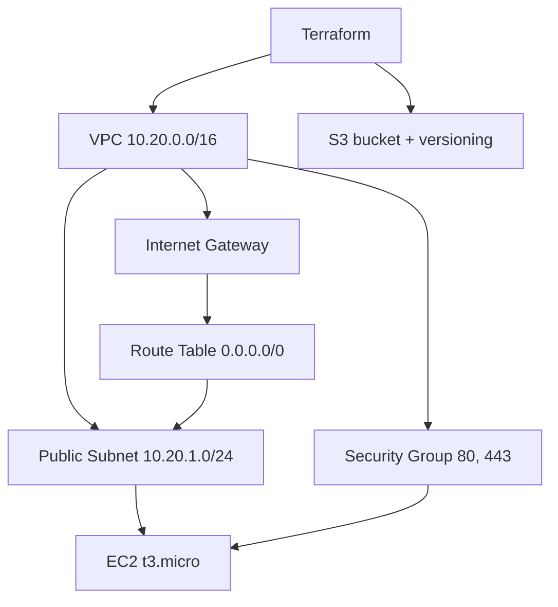
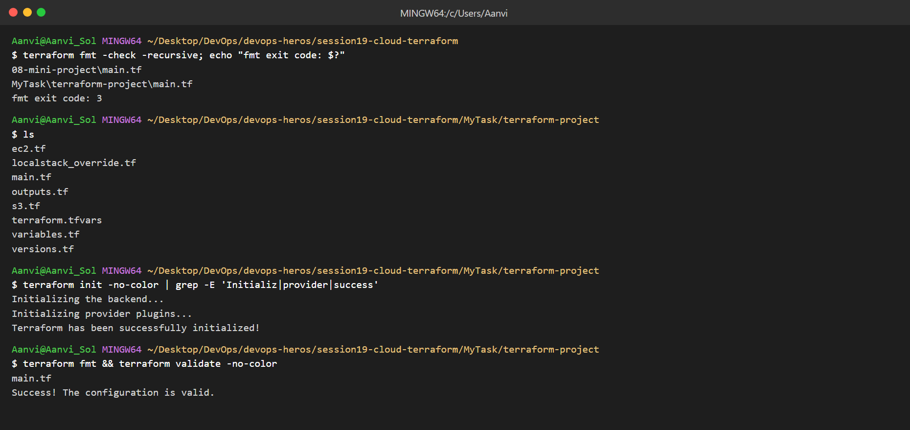
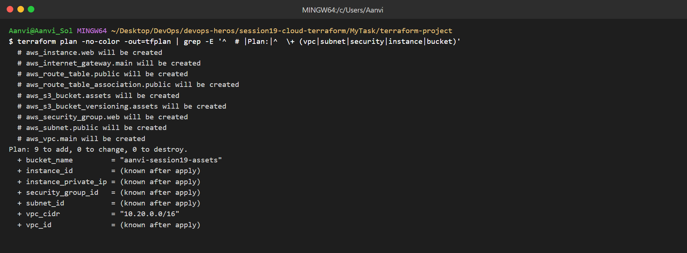
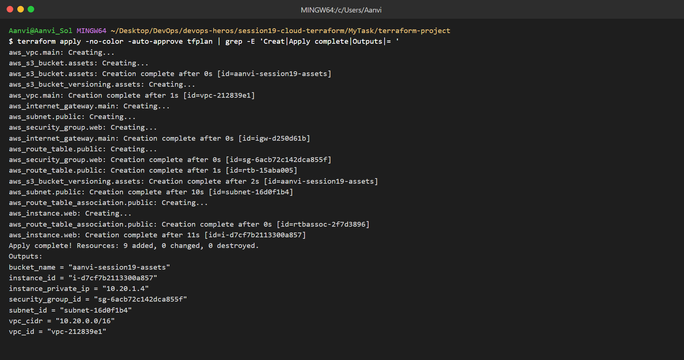
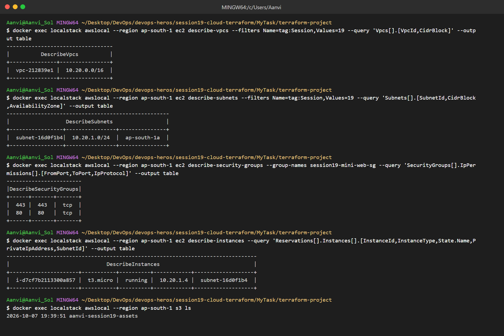
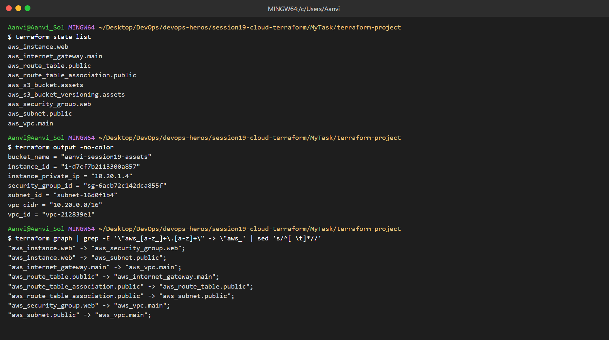
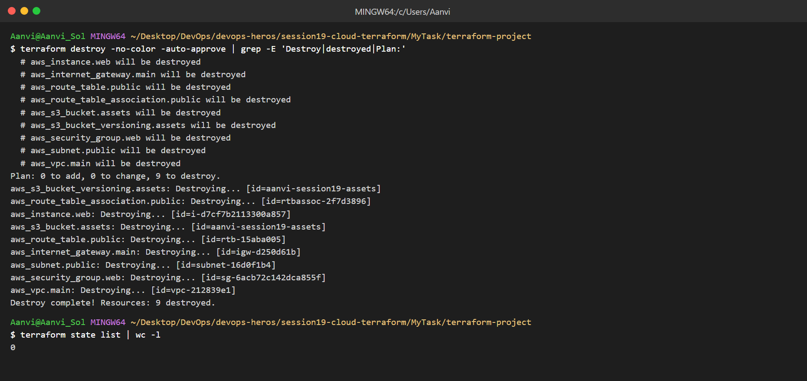
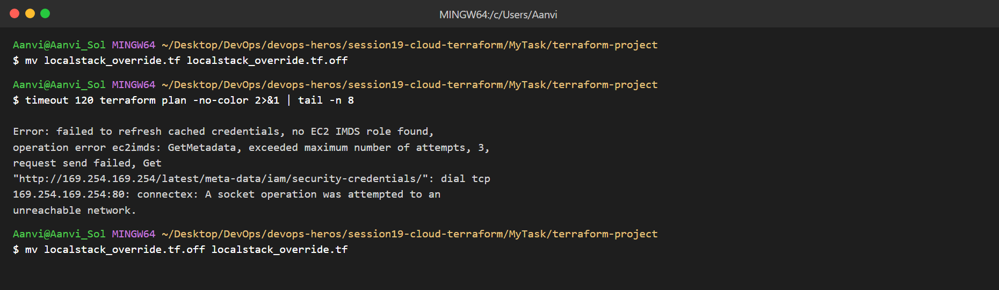

# Cloud & Terraform in Action

Name: Aanvi Solanki     Roll no.: 24bcs10170        Group: A

Project: [terraform-project](terraform-project/)

* No AWS account, so the infrastructure is created on LocalStack (local AWS emulator) using `localstack_override.tf`.

## Architecture

| Concept | Where |
|---|---|
| Provider | `versions.tf`, `localstack_override.tf` |
| Variables | `variables.tf`, `terraform.tfvars` |
| Resources | `main.tf`, `ec2.tf`, `s3.tf` |
| Outputs | `outputs.tf` |
| Dependencies | EC2 → Subnet/SG → VPC (from `terraform graph`) |
| State | `terraform state list` |

## init, fmt, validate

## terraform plan

## terraform apply

## AWS resources created

## State, outputs, dependencies

## terraform destroy

## Plan against real AWS (no credentials)

