# Monitoring, Observability & GitOps

Name: Aanvi Solanki     Roll no.: 24bcs10170        Group: A

## Task 1: Monitoring

Stack: [monitoring](monitoring/) - Prometheus + node-exporter + Grafana (provisioned datasource and dashboard) + alert rules.

### Prometheus

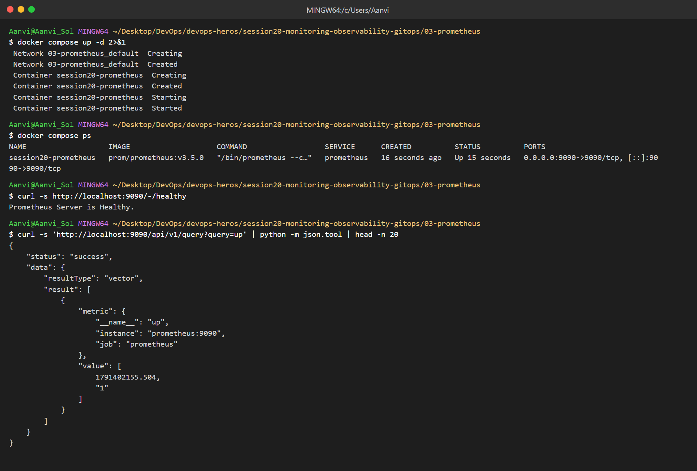
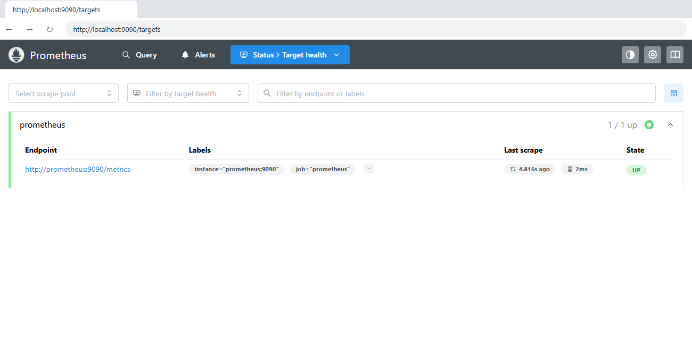
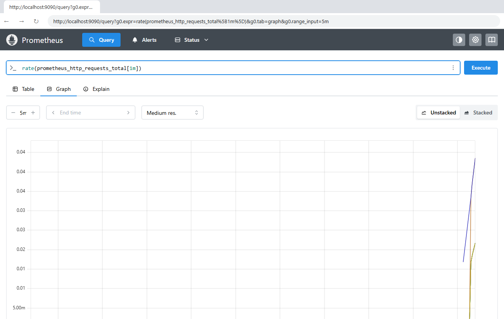

### Monitoring stack, alert rules, datasource

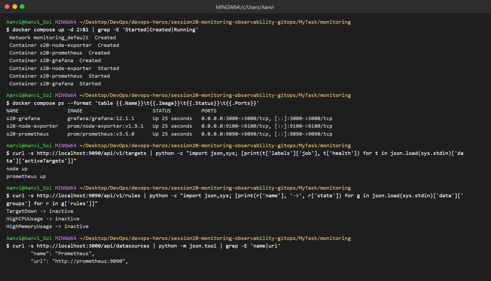
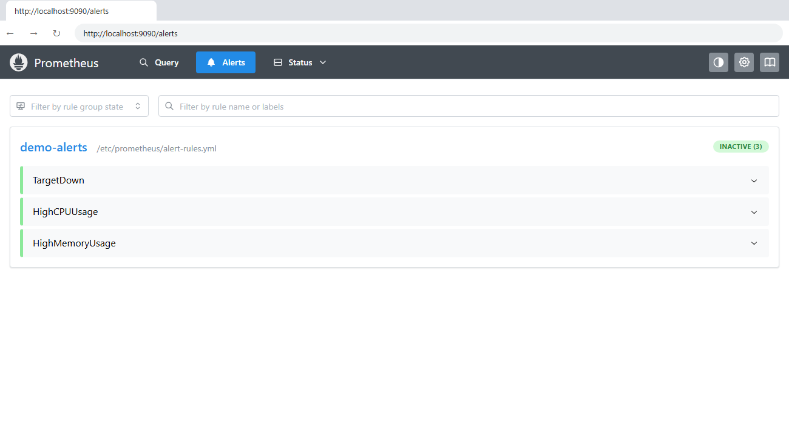

### Grafana - CPU, memory, health

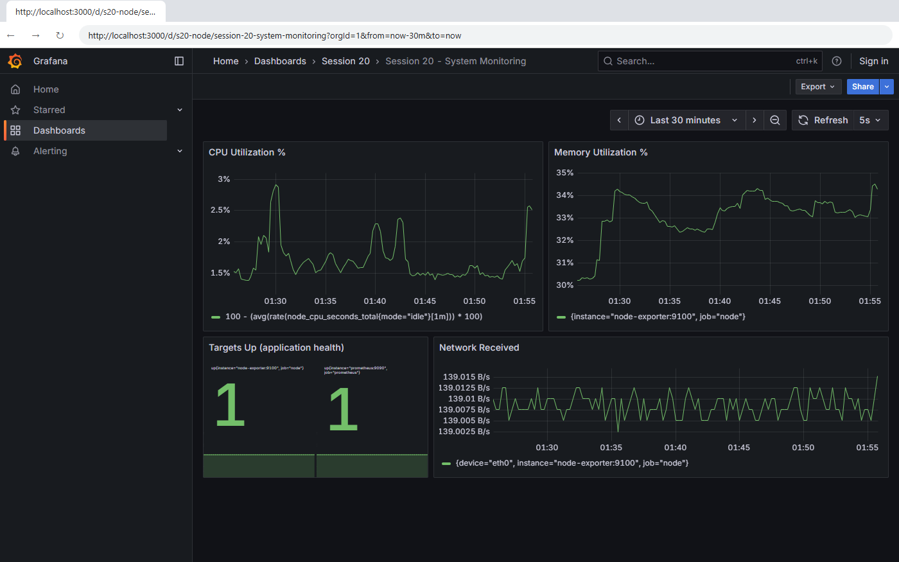

### Alert firing (target down) and resolved

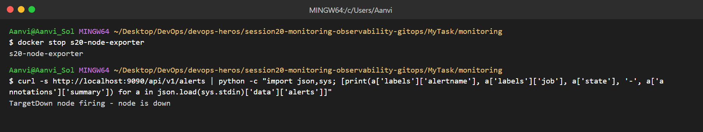
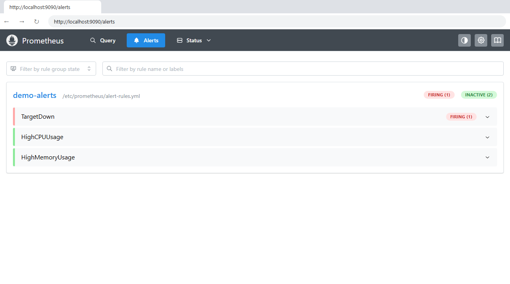
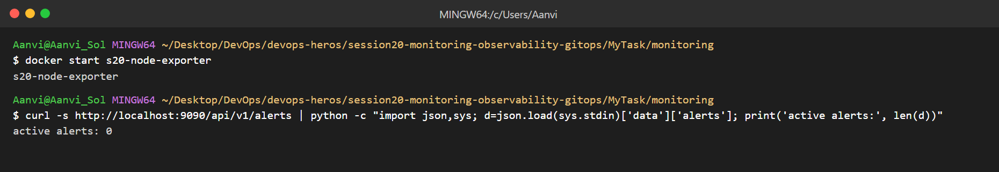

### Kubernetes - logs, metrics, health

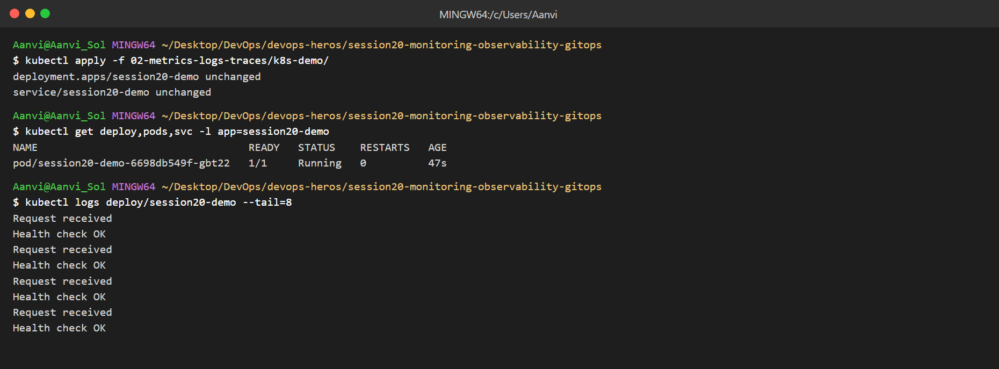
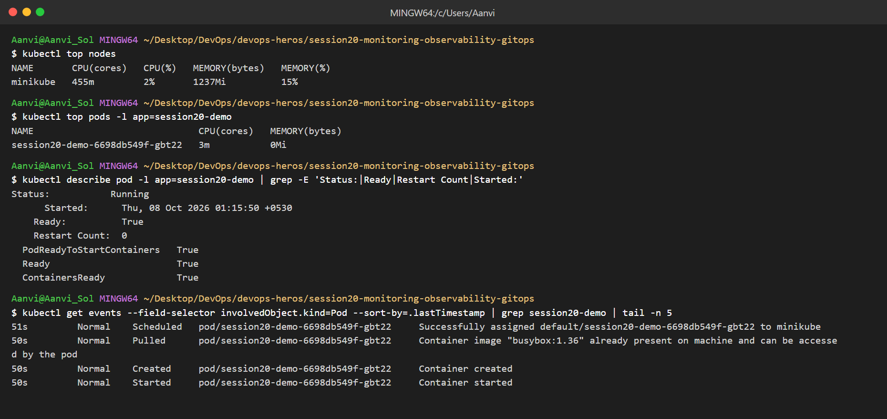

## Task 2: Observability

| Pillar | Meaning | Example tool |
|---|---|---|
| Metrics | Numbers over time (CPU, memory, requests/s) | Prometheus |
| Logs | Text events from the app | Loki, ELK, `kubectl logs` |
| Traces | Path of one request across services | Jaeger, Tempo |

* Monitoring tells *what* is wrong, observability helps find *why*.
* Needed for microservices where one request touches many services.
* Common tools: Prometheus, Grafana, Loki, Jaeger, OpenTelemetry.
* Kubernetes: metrics-server (`kubectl top`), `kubectl logs`, events, probes, kube-prometheus-stack.

## Task 3: GitOps

* GitOps: Git is the single source of truth for the desired state.
* Declarative config: YAML describes *what* should run, not steps.
* Continuous reconciliation: ArgoCD keeps comparing Git with the cluster and fixes drift.
* Workflow: change YAML → commit → push → ArgoCD syncs → cluster updated.

### Git as source of truth

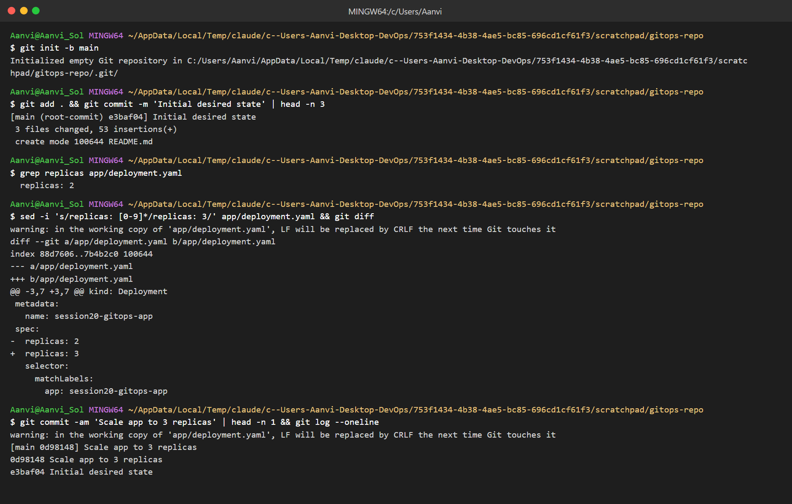

### ArgoCD application (repo: this GitHub repo, path `MyTask/gitops/app`)

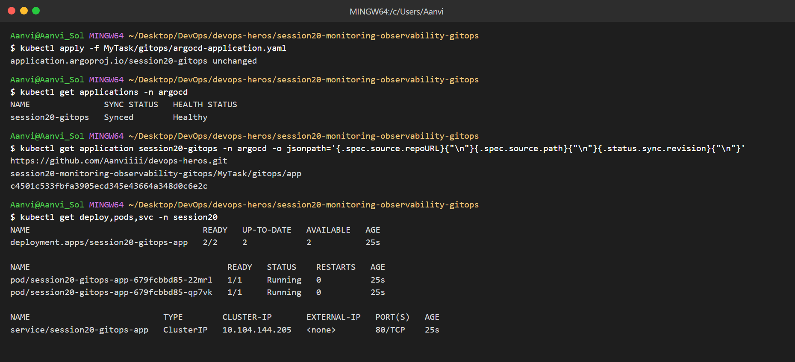
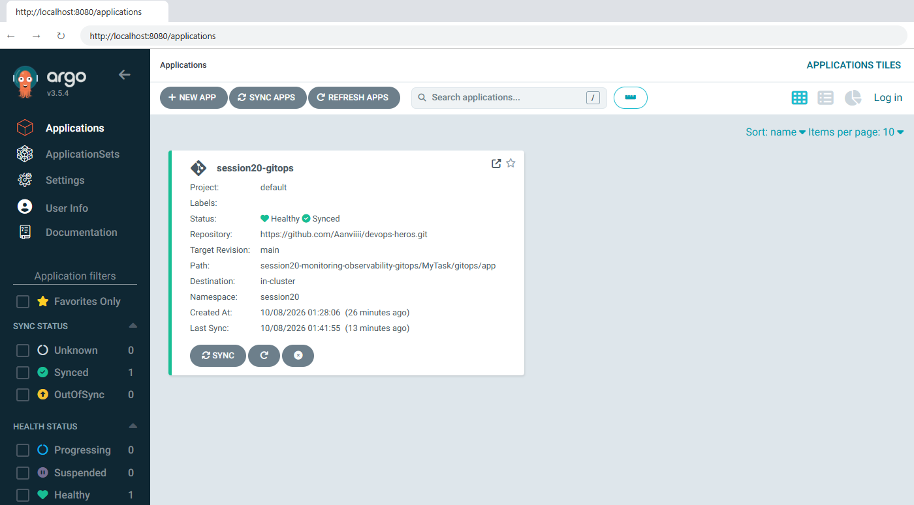
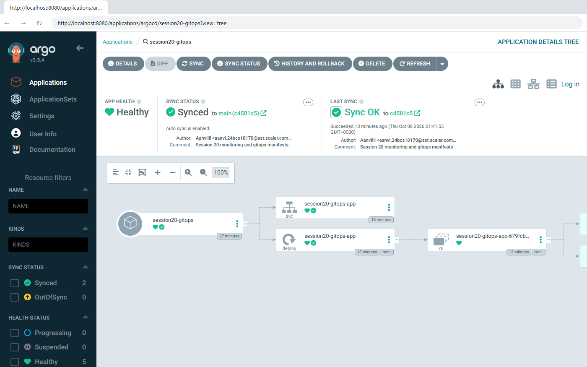

### Change in Git → auto sync (2 → 4 replicas)

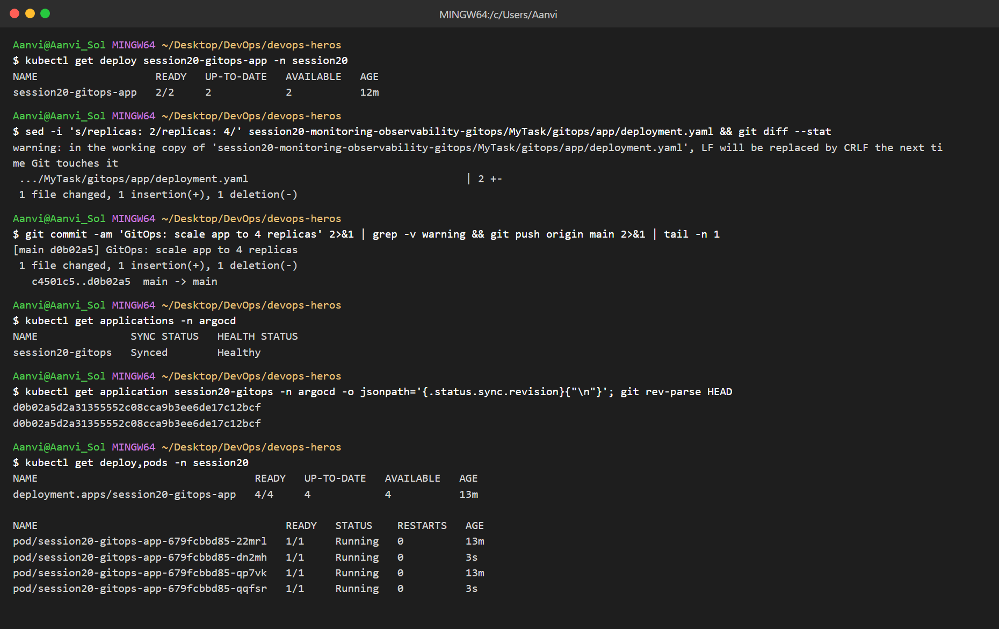

### Self-heal (manual scale to 1 is reverted to 4)

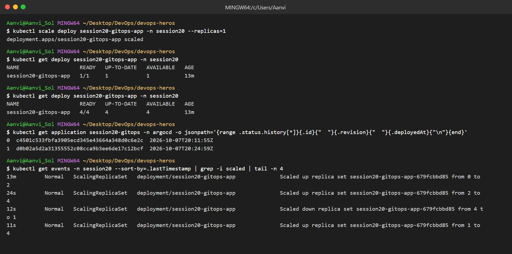
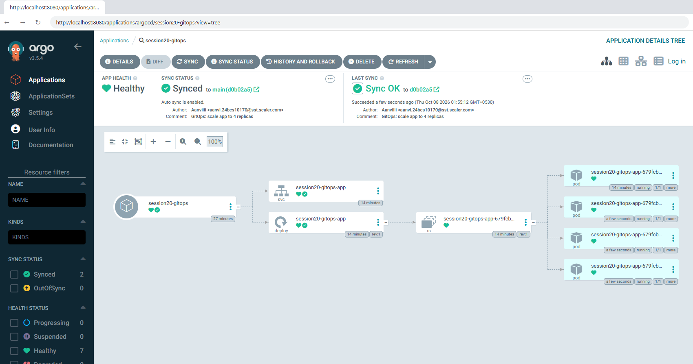
