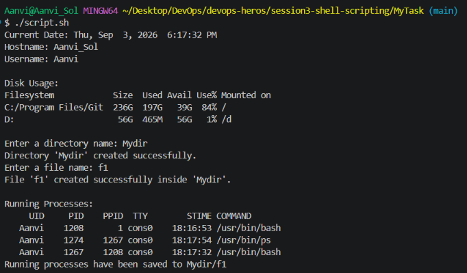

# System Information Script

## Description

This shell script performs the following tasks:

- Prints the current date
- Prints the hostname
- Prints the username
- Displays disk usage
- Displays running processes
- Accepts user input using `read -p`
- Creates a directory using `mkdir`
- Creates a file using `touch`
- Stores running process information in a file using output redirection (`>`)

## Commands Used

- mkdir
- touch
- echo
- df
- ps
- read -p
- Variables
- > (output redirection)

## Execution

Make the script executable:

```bash
chmod +x system_info.sh
```

Run the script:

```bash
./system_info.sh
```

## Sample Output

