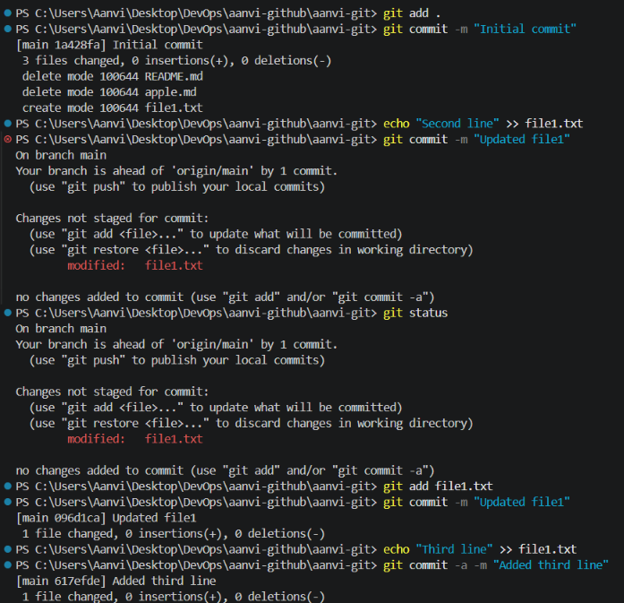

# Git Homework

## Task 1: git commit -a -m vs git commit -m

### git commit -m

* Commits only staged changes.
* Requires `git add` before committing.

### git commit -a -m

* Automatically stages modified tracked files and commits them.
* Does not stage newly created files.

### Commands Practiced

```bash
git add .
git commit -m "message"

git commit -a -m "message"
```


## Task 2: Git Cherry-Pick

### Steps Performed

1. Created multiple commits on the main branch.
2. Created a new branch using:

```bash
git checkout -b feature
```

3. Added multiple commits in the feature branch.
4. Viewed commit hashes using:

```bash
git log --oneline
```

5. Switched back to main:

```bash
git checkout main
```

6. Cherry-picked a specific commit:

```bash
git cherry-pick <commit-hash>
```

7. Verified the changes using:

```bash
git log --oneline
```

### What I Learned

* Cherry-pick allows selecting a specific commit from another branch.
* It applies only the chosen commit without merging the entire branch.
* Useful when a single bug fix or feature needs to be moved between branches.
