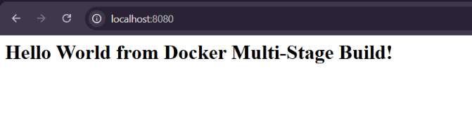
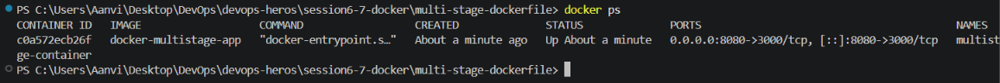
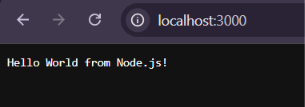
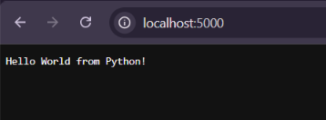
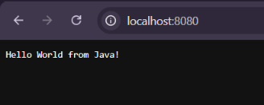

# Docker Multi-Stage Build Homework

---

## Task 1: Multi-Stage Docker Build

### Docker Image Build

```bash
docker build -t docker-multistage-app .
```

### Run Container

```bash
docker run -d -p 8080:3000 --name multistage-container docker-multistage-app
```

---

## Application Running

### Screenshot



---

## Running Container

### Command

```bash
docker ps
```

### Screenshot



---

## Task 3: Docker Application Deployment

Successfully deployed the following applications using Docker:

1. Node.js Application
2. Python Application
3. Java Application

### Screenshots

#### Node.js



#### Python



#### Java


